> **Status and disclaimers (read first).** All market data, trades and counterparty data in this project are SYNTHETIC; no market data were used. The engine is a SIMM-style educational model. It is NOT licensed by ISDA, NOT certified or validated against ISDA's calculator, and makes NO compliance claim: no number in this document is a margin call or a regulatory result. ISDA SIMM is a trademark and the ISDA documents are copyright; this repository stores only numeric parameters with citations and reproduces no ISDA text. Verification status is stated exactly in Section 19: Kupiec (1995) and Christoffersen (1998) originals not obtained; EU consolidated text, 12 CFR 237.8 and 349.8, CFTC 23.154 and the ISDA credit, equity and commodity tables not checked.

# Executive summary

This project builds, from scratch and in Python and Excel, a small but complete initial margin (IM) toolchain for a netting set of uncleared Rates and FX derivatives, and then does what a model validation or margin operations team would do with it. It computes a SIMM-style IM from first principles, compares it with the standardised schedule IM, builds a historical-simulation (HS) VaR IM as a competing model, backtests all of them with the statistical tests regulators and ISDA expect, backtests an xVA VaR model for CVA, runs a margin dispute investigation, attributes IM changes to their causes, and runs user acceptance testing (UAT) for a new product. Every step is documented here so that the author can explain it in an interview and a reviewer can reproduce it.

The sample book is one netting set (NS_A against CPTY_B) with 20 synthetic trades: 9 interest rate swaps, 3 European swaptions, 4 FX forwards and 4 FX European options in five currencies (USD, EUR, GBP, JPY, MXN). The synthetic history has 2,088 business days from 1 Oct 2018 to 30 Sep 2026 with a two-state calm and stress regime and a forced 250-day stress window.

**Headline results** (valuation date 30 Sep 2026, run mode full):

* The SIMM-style IM under parameter set v2.8+2512 is USD 5,465,781 (USD 5.47 mm), of which the FX risk class contributes USD 4,583,373 and the IR risk class USD 2,368,655 before the IR-FX correlation. Under the previous version v2.8+2506 the IM is USD 5,216,561, so the version change is worth USD 249,220 (4.8%).
* The standardised schedule IM (gross USD 22,577,637, net-to-gross ratio 0.743, net USD 19,099,501) is far larger than SIMM: the SIMM-style IM is 28.6% of the net schedule amount.
* The champion HS IM (1-day, 99%) has 18 exceptions in 1,327 days against 13.3 expected. Kupiec passes (p = 0.216) but Christoffersen conditional coverage is amber (p = 0.034) and the maximum rolling 250-day count is 12, which is in the red zone of BCBS 22. The overall light is amber.
* Every mis-calibrated challenger is worse (EWMA red, plain 250-day red, champion scaled by 0.7 red at 1 day), so the tests have power.
* On overlapping 10-day windows every HS model is red, because overlapping windows share nine days and cluster exceptions; this is a known test-design problem (Section 8). On non-overlapping windows the champion's overall light is pass (2 exceptions in 132) and the SIMM-style series' is pass (1 exceptions), but on overlapping windows the SIMM-style series fails Christoffersen independence (p = 4.0e-23) although its Kupiec p-value is 0.822.
* The dispute simulator ranked the seeded cause first in all eight single-cause scenarios and within the top three in the combined scenario (9 of 9 accepted).
* The Shapley attribution of the USD 4,040,470 IM change on COB 10 Jul 2026 is exact (zero residual); the one-at-a-time method misses USD 274,134.
* UAT of the new EUR/USD cross-currency swap: 17 passed, 0 failed, 0 skipped of 17 tests.
* The findings log has 17 items: 2 High, 10 Medium and 5 Low.

**What this project does not show.** The data are synthetic; the sample is a single netting set; there is one curve per currency; there are no credit, equity or commodity risk classes; the backtest P&L is hypothetical on a frozen portfolio; CVA is computed for linear trades only; and the engine has not been compared with ISDA's calculator. Section 16 lists every limitation found.

# Business context

## Why uncleared margin exists

Before 2008 most over-the-counter (OTC) derivatives were bilateral and many were collateralised only by variation margin (VM), the daily transfer that settles the current mark-to-market. VM does not cover the cost of closing out a defaulted counterparty's portfolio over the days it takes to do so, because prices keep moving in those days. Initial margin (IM) is a buffer posted in addition to VM that is meant to cover that move with high confidence. Central counterparties (CCPs) have always collected IM; the post-crisis reforms extended the idea to trades that are not centrally cleared.

The international standard is the BCBS-IOSCO framework for margin requirements for non-centrally cleared derivatives. Its central quantitative requirement is that IM should reflect an extreme but plausible increase in the value of the portfolio, consistent with a one-tailed 99 per cent confidence interval over a 10-day horizon, calibrated to historical data that include a period of significant financial stress (BCBS-IOSCO April 2020, Requirement 3.1). Two routes are allowed: a quantitative portfolio margin model, or a standardised schedule of margin rates by asset class and maturity. The schedule is simple but conservative and does not recognise hedging between trades except through the net-to-gross ratio; models such as SIMM recognise offsets, which is why firms use them.

## The rules in the United States and the European Union

In the United States the prudential regulators implement the framework in rules such as 12 CFR Part 45 for the OCC. The model route requires a 99 percent one-tailed estimate of the increase in value over the shorter of ten business days or the maturity, calibration data that are equally weighted, cover at least one and at most five years and include a period of significant financial stress, and validation that includes backtesting (12 CFR 45.8(d) and (f)(2)). The parallel rules of other agencies (12 CFR 237.8, 349.8, CFTC 23.154) were not fetched in this project.

In the European Union the technical standards are in Commission Delegated Regulation (EU) 2016/2251. It requires a 99 percent one-tailed confidence interval over a margin period of risk of at least 10 days (Article 15), calibration on 3 to 5 years of data of which at least 25 percent must come from a stressed period, with the oldest data replaced by stress data until that share is met and equal weights throughout (Article 16), and ongoing model monitoring including backtesting at least every three months (Article 14(3)). This project's champion model follows the Article 16 pattern, labelled "EU 1+3 style" in the code. The consolidated text with later amendments was not checked.

## Why SIMM exists and why IM models are backtested

If every pair of counterparties used its own model, the two sides would compute different IM for the same portfolio and every margin call would be disputed. The ISDA Standard Initial Margin Model (SIMM) is an industry-wide, sensitivity-based methodology: both sides compute the same sensitivities, apply the same risk weights and correlations, and so should reach (nearly) the same IM. ISDA recalibrates the parameters periodically, and its governance framework sets the calibration standard (99 percent, 10-day, including stress), the dispute escalation steps, a SIMM shortfall amount where SIMM is found to under-margin, and backtesting with the Basel traffic-light approach (ISDA SIMM Governance Framework 18 Sep 2026).

A margin model that is wrong in one direction leaves a hole in the protection; wrong in the other direction it locks up collateral for nothing. Regulators and model risk policy therefore require outcomes analysis. The US supervisory guidance on model risk management lists three core elements of validation: evaluation of conceptual soundness, ongoing monitoring including benchmarking, and outcomes analysis including back-testing (SR 11-7). This project covers all three for a toy but realistic model: conceptual documentation (this document), benchmarking against the schedule and an HS model, and backtests.

## The jobs this project exercises

A margin or CCR analyst typically does four things: run and reconcile the IM calculation; investigate disputes with counterparties; explain why IM moved from yesterday to today; and onboard new products. A validator additionally backtests the model and writes findings. Sections 11 to 14 map one-to-one onto these tasks.

# Data and the sample portfolio

## The synthetic market history

Because no real market data are used, the history is simulated by `market_history.generate_history`. The design goal is not realism for trading but a history that has the features the backtests need: fat tails, volatility clustering, regimes and a stress episode.

* **Regimes.** A two-state Markov chain (calm and stress) with persistence parameters in `config.REGIME_PERSISTENCE` (calm 0.99, stress 0.97) drives the scale of all shocks. The stress state multiplies shock volatility by `config.STRESS_VOL_MULT` = 2.8. In this history 817 days (39.1%) are in the stress state and 1271 are calm.
* **Fat tails.** Shocks are multivariate Student-t with 5 degrees of freedom, built with one common chi-square mixing draw per day.
* **Rates.** Each currency has three PCA-style factors (level, slope, curvature) that mean-revert, with loadings on the 12 SIMM tenors, a cross-currency correlation through a global factor, and a stress drift in the level factor.
* **FX.** Log returns for EUR/USD, GBP/USD, USD/JPY and USD/MXN with a common USD factor and mean reversion.
* **Volatilities.** Normal volatilities for swaptions and lognormal volatilities for FX options follow log AR(1) processes pushed up in stress.
* **Credit.** Five CDS spreads (1, 3, 5, 7, 10 years) with jumps on entry to stress; these feed the CVA in Section 10.
* **Forced stress window.** A 250-day window from 1 Mar 2019 to 13 Feb 2020 is forced into the stress state. It plays the role of the "financial stress period" the regulations require in the calibration data. It is placed early in the history so that every later date can use it without look-ahead.

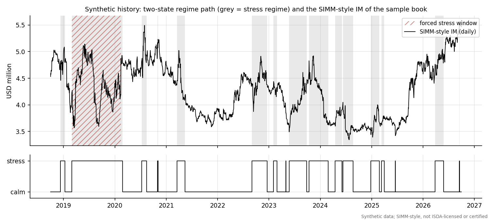

Synthetic data have a consequence that should be said plainly: the backtest statistics measure how well the model's assumptions fit a simulated world whose generator we wrote, not how well a margin model fits real markets. The value of the exercise is in the methodology and in seeing the tests behave correctly, including rejecting deliberately wrong models.

## The sample portfolio

The portfolio is one legally enforceable netting set, NS_A, with counterparty CPTY_B. The trade table below gives the terms that matter for risk. Swaption and option expiries and all maturities are year fractions from the valuation date; the portfolio is frozen with constant time to maturity (no ageing), which is explained in Section 8.

| Trade | Product | Currency | Terms | Notional (mm, first ccy) | Direction | PV (USD) |
|:---|:---|:---|:---|---:|:---|---:|
| IRS_USD_2Y | IRS | USD | 2y | 60 | pay fixed | 475,771 |
| IRS_USD_5Y | IRS | USD | 5y | 40 | receive fixed | -1,042,408 |
| IRS_USD_10Y | IRS | USD | 10y | 25 | pay fixed | 904,651 |
| IRS_USD_30Y | IRS | USD | 30y | 10 | receive fixed | -539,620 |
| IRS_EUR_5Y | IRS | EUR | 5y | 30 | pay fixed | 362,788 |
| IRS_EUR_10Y | IRS | EUR | 10y | 20 | receive fixed | 179,763 |
| IRS_GBP_7Y | IRS | GBP | 7y | 25 | pay fixed | 152,324 |
| IRS_JPY_10Y | IRS | JPY | 10y | 4,000 | receive fixed | -865,234 |
| IRS_MXN_3Y | IRS | MXN | 3y | 500 | pay fixed | 1,891,311 |
| SWPT_USD_1Yx5Y | SWAPTION | USD | payer 1y x 5y | 50 | long | 1,213,662 |
| SWPT_EUR_4Yx10Y | SWAPTION | EUR | receiver 4y x 10y | 30 | long | 2,062,560 |
| SWPT_GBP_5Yx5Y | SWAPTION | GBP | payer 5y x 5y | 25 | short | -1,037,840 |
| FXF_EURUSD_6M | FXFWD | EUR/USD | 0.5y | 25 | buy base | 3,371,587 |
| FXF_GBPUSD_1Y | FXFWD | GBP/USD | 1y | 15 | sell base | -299,975 |
| FXF_USDJPY_3M | FXFWD | USD/JPY | 0.25y | 20 | buy base | -250,225 |
| FXF_USDMXN_6M | FXFWD | USD/MXN | 0.5y | 10 | sell base | 918,421 |
| FXO_EURUSD_C3M | FXOPT | EUR/USD | call 0.25y | 20 | long | 2,572,584 |
| FXO_USDMXN_C1Y | FXOPT | USD/MXN | call 1y | 10 | long | 187,279 |
| FXO_GBPUSD_STRADDLE_C | FXOPT | GBP/USD | call 0.5y | 15 | long | 796,644 |
| FXO_GBPUSD_STRADDLE_P | FXOPT | GBP/USD | put 0.5y | 15 | long | 627,284 |

Table: The sample portfolio at the valuation date. Directions: pay fixed or receive fixed for swaps; long or short for options; buy or sell the base currency for forwards. Notionals are in millions of the first currency (JPY and MXN notionals are therefore large numbers).

The total PV of the book is USD 11.68 mm (positive PVs sum to USD 15.72 mm and negative PVs to USD -4.04 mm). These two numbers matter later because the schedule IM uses the net-to-gross ratio of replacement costs.

The new product used in UAT (Section 13) is a 5-year EUR/USD cross-currency basis swap on EUR 50 million, booked separately from the book above.

# Pricing and sensitivities

## Curves

Each currency has one OIS-style curve, built by `curves.bootstrap_curve` from par quotes at the 12 SIMM tenor vertices: 2 weeks, 1, 3 and 6 months (simple cash rates) and 1, 2, 3, 5, 10, 15, 20 and 30 years (annual-pay par swap rates). Bootstrapping means solving, vertex by vertex, for the zero rate that makes the instrument price exactly at par given the zero rates already found. Zero rates are continuously compounded and linear in time between vertices with flat extrapolation, so the discount factor is $DF(t) = \exp(-z(t)\,t)$. The annuity of a swap with accrual periods $\tau_i$ and payment times $t_i$ is $A = \sum_i \tau_i DF(t_i)$, and the par swap rate is $(1 - DF(T))/A$. Because a single curve discounts and projects, floating legs are worth $DF(t_0) - DF(t_1)$.

The bootstrap also gives the par-to-zero Jacobian $J_{ij} = \partial z_i / \partial s_j$ by twelve re-bootstraps (`par_to_zero_jacobian`). SIMM interest rate delta is defined per basis point of the par instrument quote, so a sensitivity to zero rates must be converted with this Jacobian. The test suite checks the shortcut against a full re-bootstrap for every bump.

## Instrument pricing

`pricing.price_portfolio` values all trades for many market states at once (vectorised), which is what makes the 2 million revaluations of the VaR backtest affordable.

* **Interest rate swap.** $PV = N\,\omega\,[(DF(0) - DF(T)) - K\,A]$ with $\omega = +1$ for pay fixed, in USD after multiplying by the spot.
* **Swaption (Bachelier).** Rates can be negative or near zero, so volatilities are quoted as normal (absolute) vols. With forward swap rate $F$, strike $K$, expiry $T$ and normal volatility $\sigma$, the payer price per unit annuity is
$$ (F-K)\,\Phi(d) + \sigma\sqrt{T}\,\phi(d), \qquad d = \frac{F-K}{\sigma\sqrt{T}} , $$
and the value is notional times annuity times that price. The vega per unit of normal vol is $A\sqrt{T}\,\phi(d)$, which the tests check against a bump.
* **FX forward.** By interest rate parity the forward is $S\,DF_{base}/DF_{quote}$, and the value is $N\omega\,(S_b DF_b - K\,S_q DF_q)$ in USD.
* **FX option (Garman-Kohlhagen).** The Black formula for a currency option with forward $F$, strike $K$, lognormal vol $\sigma$ and quote-currency discount factor: call $= DF_q\,[F\Phi(d_1) - K\Phi(d_2)]$ with $d_{1,2} = [\ln(F/K) \pm \tfrac12\sigma^2 T]/(\sigma\sqrt{T})$. Put-call parity is a test.
* **Cross-currency swap.** Two floating legs, each on its own currency curve, plus $(\text{contract basis} - \text{market basis})\times$ annuity. When `settle_notional_exchange` is "eligible" the final principal exchange is excluded from the IM sensitivities, following the rule that models need not capture the fixed physically settled exchange of principal (BCBS-IOSCO April 2020, Requirement 1.2).

## Sensitivity conventions

SIMM works on sensitivities, so the quality of the sensitivities caps the quality of the IM. The conventions used in `sensitivities.py` follow the ISDA Risk Data Standards, which define the CRIF (Common Risk Interchange Format) exchange file (ISDA Risk Data Standards v1.36).

| Risk | Bump | Output |
|:---|:---|---:|
| IR delta | $\pm$ 0.5bp central difference on one par quote | USD per 1bp of the par quote, at 12 vertices |
| IR vega | $\pm$ 0.5bp of normal vol | vega times the market normal vol (USD), allocated to expiry vertices |
| FX delta | $\pm$ 0.5% relative move of the currency against USD | USD per 1%, including translation risk |
| FX vega | $\pm$ 0.5 vol point | vega per unit vol times the market vol (USD) |
| Cross-currency basis | $\pm$ 0.5bp of contract basis | USD per 1bp |

**Linear rebucketing.** A 7-year swap sits between the 5-year and 10-year vertices. Its sensitivity is split linearly: the weight on the 10-year vertex is $(7-5)/(10-5) = 0.4$ and on the 5-year vertex $0.6$. Swaption vega is allocated the same way across expiry vertices. Disputes arise when two parties rebucket differently (scenario D6 in Section 11).

**Translation risk.** An FX delta in SIMM is the change in USD value for a 1% rise of the foreign currency against USD. A EUR interest rate swap has no FX forward in it, but its PV is in euros, so a 1% EUR rise changes its USD value by 1% of the PV. That is why the EUR, GBP, JPY and MXN swaps appear in the FX delta rows of the CRIF.

## The CRIF

`crif.build_crif` turns the sensitivities into a CRIF-style table with the columns TradeID, PortfolioID, ProductClass, RiskType, Qualifier, Bucket, Label1, Label2, Amount, AmountCurrency and AmountUSD. At the valuation date the CRIF has 96 rows.

| Risk type | CRIF rows | Trades | Sum of |AmountUSD| |
|:-----------|--------:|-----:|-----------------:|
| Risk_FX | 15 | 15 | 1,310,700 |
| Risk_FXVol | 4 | 4 | 1,853,154 |
| Risk_IRCurve | 73 | 20 | 235,159 |
| Risk_IRVol | 4 | 3 | 3,785,988 |

Table: The CRIF of the sample book by risk type.

**An issue found and fixed during the build: the FX vega convention.** A SIMM vega amount is vega times implied volatility, but for FX the "implied volatility" that SIMM weights is not the market vol. It is $\sigma_{SIMM}$ derived from the FX risk weight (Section 5). The engine therefore needs the market vol to recover the raw vega from the CRIF amount. The first version of the CRIF did not carry it, and the engine overstated FX vega and curvature margin (16.44 mm against 5.47 mm of total IM for the sample book in an early run, a clear red flag against the plausible magnitude). The fix is an extra CRIF column, `SigmaMarket`, filled on the 4 FX vega rows. This is not a standard CRIF column, so it is also finding F-12 in Section 14 and the cause of dispute scenario D4: a counterparty that treats the amount as already weighted gets a different IM from an identical-looking file.

# SIMM step by step

This section explains every formula of the SIMM-style engine in `simm.py`, in the order the calculation runs. The structure follows the public methodology text (ISDA SIMM v2.8+2512, paras 5 to 11); all numbers come from `data/parameters/simm_parameters.csv`, loaded by `params.load`. The engine covers the RatesFX product class with two risk classes, IR and FX, each with delta, vega and curvature margin.

## The idea in one paragraph

SIMM treats the portfolio as a vector of sensitivities to standard risk factors. Each sensitivity is multiplied by a risk weight (roughly a 10-day, 99 percent move of that factor in sensitivity units), giving a weighted sensitivity $WS$. Within a bucket (for IR, a currency) the weighted sensitivities are combined with a correlation matrix, so that opposite positions in correlated factors offset: $K_b = \sqrt{\sum WS_k^2 + \sum\sum \rho_{kl} WS_k WS_l}$. Buckets are then combined with a cross-bucket correlation, risk classes with another, and the delta, vega and curvature margins are added. It is a parametric approximation to a 99 percent, 10-day stressed VaR, which is exactly what makes backtesting it against historical losses meaningful.

## Weighted sensitivities and concentration

For each risk factor $k$ the net sensitivity $s_k$ is the sum over all trades. The weighted sensitivity is
$$ WS_k = RW_k \, s_k \, CR_b , \qquad CR_b = \max\!\left(1, \sqrt{\frac{\left|\sum_k s_k\right|}{T_b}}\right) . $$
$RW_k$ is the risk weight, $T_b$ the concentration threshold of the bucket in USD millions per basis point (IR delta), and $CR_b$ the concentration risk factor. The idea is that a very large position in a currency cannot be liquidated in 10 days at the same price as a small one, so the risk weight is scaled up once the net position exceeds a threshold. Below the threshold $CR = 1$ and the margin is linear in position size; above it the margin grows faster than linearly. Cross-currency basis rows are neither summed into the CR nor scaled (their $CR$ is 1).

**Parameters.** The IR delta risk weights depend on the volatility group of the currency. For the sample currencies:

| Tenor | Regular (USD, EUR, GBP) | Low volatility (JPY) | High volatility (MXN) |
|:----|----------------------:|-------------------:|--------------------:|
| 2w | 107 | 15 | 167 |
| 1m | 101 | 18 | 102 |
| 3m | 90 | 12 | 79 |
| 6m | 69 | 11 | 82 |
| 1y | 68 | 15 | 90 |
| 2y | 69 | 21 | 93 |
| 3y | 66 | 23 | 92 |
| 5y | 61 | 25 | 88 |
| 10y | 60 | 29 | 88 |
| 15y | 58 | 27 | 98 |
| 20y | 58 | 26 | 101 |
| 30y | 66 | 28 | 96 |

Table: IR delta risk weights by tenor (basis point of sensitivity, v2.8+2512). JPY is the only low-volatility currency; MXN is in the high-volatility group.

Further parameters used by the engine, for both versions:

| Parameter | v2.8+2512 | v2.8+2506 |
|:---|---:|---:|
| IR delta: sub-curve correlation phi | 98.1% | 98.1% |
| IR delta: inflation to yield correlation | 42.0% | 42.0% |
| IR delta: cross-currency basis to yield correlation | -1.0% | -1.0% |
| IR delta: inter-currency gamma | 35.0% | 35.0% |
| IR delta: risk weight, inflation | 51 | 51 |
| IR delta: risk weight, cross-currency basis | 21 | 21 |
| IR vega: risk weight VRW | 0.20 | 0.20 |
| IR curvature: HVR (curvature scaled by HVR to the power -2) | 0.74 | 0.74 |
| FX delta: risk weight, regular currency against USD | 7.4 | 7.1 |
| FX delta: correlation between two regular-group currencies | 50.0% | 50.0% |
| FX vega: risk weight VRW | 0.33 | 0.34 |
| FX vega: HVR | 0.67 | 0.68 |
| FX vega and curvature: correlation | 50.0% | 50.0% |
| Risk class correlation psi, IR to FX | 15.0% | 10.0% |

Table: Main SIMM-style parameters (correlations and gamma as percent; risk weights as printed in the methodology).

Concentration thresholds are in USD millions (per bp for IR delta, per 1% for FX delta, per unit of vega-times-vol for vega):

| IR currency group | Delta v2.8+2512 (USD mm/bp) | Delta v2.8+2506 | Vega v2.8+2512 (USD mm) | Vega v2.8+2506 |
|:---|---:|---:|---:|---:|
| Well-traded (USD, EUR, GBP) | 220 | 210 | 3,800 | 4,400 |
| Less well-traded | 110 | 100 | 520 | 480 |
| Low volatility (JPY) | 370 | 230 | 1,100 | 860 |
| High volatility (for example MXN) | 71 | 51 | 160 | 110 |

Table: IR concentration thresholds by currency group.

| FX category | Currencies | Delta v2.8+2512 (USD mm per 1%) | Delta v2.8+2506 |
|:---|:---|---:|---:|
| Category 1 | USD EUR JPY GBP AUD CHF CAD | 2,100 | 3,100 |
| Category 2 | BRL CNY HKD INR KRW MXN NOK NZD RUB SEK SGD TRY ZAR | 710 | 950 |
| Category 3 | all other currencies | 120 | 160 |

Table: FX delta concentration thresholds by category.

**Concentration risk example.** Take one hypothetical USD 5-year sensitivity, $RW = 61$ and threshold $T_b = 220$ USD mm per bp. For a net sensitivity of USD 50,000,000 per bp (50 million) the position is below the threshold of 220 million, so $CR = 1$ and $WS = 3,050,000,000$. For USD 500,000,000 per bp, $CR = \sqrt{500/220} = 1.5076$ and $WS = 45,980,480,048$, which is 1.5076 times more than the linear scaling of the small case (30,500,000,000) would give; the engine's IM for this single row is 45,980,480,048. In the sample book every net sensitivity is far below its threshold, so the concentration factors in the book are all equal to 1 (see Table of IR buckets below). The effect is exercised only in tests and in this example. These sensitivities are deliberately unrealistic in size to show the mechanics.

## Delta margin for interest rates

Within one currency bucket the weighted sensitivities of the 12 tenors (and the sub-curves, inflation and cross-currency basis rows when present) are combined as
$$ K_b = \sqrt{\sum_k WS_k^2 + \sum_k \sum_{l \ne k} \rho_{kl}\, WS_k WS_l } , $$
where $\rho_{kl}$ is the 12 by 12 tenor correlation (for the same sub-curve), multiplied by the sub-curve correlation $\varphi = 98.1\%$ if the two rows are on different sub-curves of the same currency, equal to 42% between an inflation and a yield row and $-1\%$ between a cross-currency basis row and any other row. The sample uses one sub-curve ("OIS") per currency, so $\varphi$ is never exercised (finding F-03). The tenor correlation matrix is symmetric and positive semidefinite (smallest eigenvalue 0.005015); a sample of it is below.

| Tenor | 1y | 2y | 3y | 5y | 10y | 30y |
|:---|---:|---:|---:|---:|---:|---:|
| 1y | 1.00 | 0.94 | 0.87 | 0.81 | 0.73 | 0.63 |
| 2y | 0.94 | 1.00 | 0.97 | 0.92 | 0.86 | 0.76 |
| 3y | 0.87 | 0.97 | 1.00 | 0.97 | 0.91 | 0.81 |
| 5y | 0.81 | 0.92 | 0.97 | 1.00 | 0.96 | 0.88 |
| 10y | 0.73 | 0.86 | 0.91 | 0.96 | 1.00 | 0.95 |
| 30y | 0.63 | 0.76 | 0.81 | 0.88 | 0.95 | 1.00 |

Table: A sample of the IR tenor correlation matrix (v2.8+2512).

Across currencies, define $S_b = \max(\min(\sum_k WS_k, K_b), -K_b)$, the net weighted sensitivity of the bucket clipped to the range of $K_b$. Then
$$ \text{DeltaMargin}_{IR} = \sqrt{\sum_b K_b^2 + \sum_b \sum_{c \ne b} \gamma_{bc}\, g_{bc}\, S_b S_c } , \qquad g_{bc} = \frac{\min(CR_b, CR_c)}{\max(CR_b, CR_c)} , $$
with the inter-currency correlation $\gamma = 35\%$. The $g_{bc}$ factor softens the cross-bucket correlation when one currency is much more concentrated than the other.

**FX delta.** All currencies against the calculation currency form a single bucket. Each currency's weighted sensitivity uses the FX risk weight (7.4 for a regular-group currency against USD in v2.8+2512) and its own concentration factor, and the margin is $K = \sqrt{WS' M\,WS}$ with correlation 50% between currencies in the regular group, scaled by $\min(CR_k, CR_l)/\max(CR_k,CR_l)$. The USD itself has no FX risk factor.

**Results for the sample book.**

| Currency bucket | CR | Sum of |WS| | K_b | S_b |
|:--------------|---:|----------:|--------:|---------:|
| USD | 1.00 | 3,911,714 | 808,937 | 693,430 |
| EUR | 1.00 | 4,181,909 | 1,351,538 | -1,306,486 |
| GBP | 1.00 | 1,554,785 | 971,144 | 971,144 |
| JPY | 1.00 | 727,356 | 708,221 | -703,894 |
| MXN | 1.00 | 726,527 | 637,216 | 623,385 |

Table: IR delta buckets of the sample book. $K_b$ is smaller than the sum of $|WS|$ because opposite positions at neighbouring tenors offset.

The sum of the five $K_b$ is USD 4,477,056 while the IR delta margin is USD 1,718,578, a further reduction from offsetting positions between currencies. FX delta is the largest single margin component, USD 3,678,282, from the FX risk factor weighted sensitivities:

| FX risk factor (currency against USD) | Weighted sensitivity (USD) |
|:------------------------------------|-------------------------:|
| EUR | 4,213,017 |
| GBP | -1,273,876 |
| JPY | -1,547,288 |
| MXN | 774,536 |

Table: FX delta weighted sensitivities of the book. The sum of absolute values is USD 7,808,717; the margin is lower because EUR, GBP, JPY and MXN positions partly offset at 50% correlation.

## A fully worked example with two currencies

To make the mechanics hand-checkable, take only two trades from the book: the USD 5-year receive-fixed swap IRS_USD_5Y (USD 40 million) and the EUR 5-year pay-fixed swap IRS_EUR_5Y (EUR 30 million). Their CRIF rows give these weighted sensitivities (all concentration factors are 1):

| Currency | Tenor | s (USD per bp) | RW | CR | WS (USD) |
|:---|:---|---:|---:|---:|---:|
| USD | 1y | 18.26 | 68 | 1 | 1,242 |
| USD | 2y | 37.28 | 69 | 1 | 2,572 |
| USD | 3y | 96.18 | 66 | 1 | 6,348 |
| USD | 5y | -17,421.69 | 61 | 1 | -1,062,723 |
| EUR | 1y | -6.72 | 68 | 1 | -457 |
| EUR | 2y | -13.59 | 69 | 1 | -938 |
| EUR | 3y | -34.63 | 66 | 1 | -2,286 |
| EUR | 5y | 16,903.13 | 61 | 1 | 1,031,091 |

Table: Worked example, step 1: net sensitivity $s$ (USD per bp), risk weight, concentration factor and weighted sensitivity for the two swaps.

**Step 2, bucket K.** In the USD bucket the 5-year weighted sensitivity is -1,062,723. The 1, 2 and 3-year rows are small and of opposite sign, and their correlations with the 5-year vertex are 0.81, 0.92 and 0.97, so they slightly offset the large row. The formula gives $K_{USD} = 1,053,197$, a little below $|WS_{5y}|$. In the EUR bucket the same calculation gives $K_{EUR} = 1,027,641$. The documentation build recomputes both from the correlation matrix in numpy and aborts if they differ from the engine by more than a relative $10^{-6}$.

**Step 3, net weighted sensitivity.** $S_{USD} = -1,052,561$ and $S_{EUR} = 1,027,410$. Both are inside $[-K_b, K_b]$ so no clipping occurs. The signs are opposite (a receive-fixed USD swap against a pay-fixed EUR swap), which is a hedge if the two curves move together.

**Step 4, across currencies.** With $\gamma = 35\%$ and $g = 1$ the cross term is $2\gamma S_{USD} S_{EUR} = -7.570e+11$, which is negative:
$$ \text{Delta}_{IR} = \sqrt{K_{USD}^2 + K_{EUR}^2 + 2\gamma S_{USD} S_{EUR}} = \sqrt{1.109e+12 + 1.056e+12 + (-7.570e+11)} = 1,186,711 . $$
The simple sum $K_{USD}+K_{EUR}$ would be 2,080,839, so the cross-currency offset saves 43%. This is the diversification SIMM gives for hedged positions, and also what the schedule IM cannot give.

**Step 5, FX.** The EUR swap has an FX delta (translation) of USD 3,627.88 per 1%, weighted by risk weight 7.4 to 26,846. This is the only FX factor, so FX delta margin equals $|WS|$. There are no options, so vega and curvature margins are zero, and the IR and FX risk class IMs are 1,186,711 and 26,846.

**Step 6, product class.** With $\psi_{IR,FX} = 15\%$,
$$ \text{SIMM}_{RatesFX} = \sqrt{IM_{IR}^2 + IM_{FX}^2 + 2\psi\, IM_{IR}\, IM_{FX}} = 1,191,034 , $$
against 1,213,557 for the simple sum of the two risk classes. The two-trade IM is therefore 1,191,034; the engine returns exactly this number.

## Vega margin

An option's value depends on implied volatility, so SIMM adds a vega margin. For interest rates the vega risk factor is the implied volatility of a swaption expiry (12 expiry vertices). For each factor the weighted vega risk is $VR_k = VRW \cdot (\sum_i VR_{ik}) \cdot VCR_b$, where $VR_{ik}$ is the vega of instrument $i$ times its implied volatility ("vega risk exposure"), $VRW$ the vega risk weight (0.20 for IR) and $VCR_b$ the vega concentration factor, defined like $CR$ with the vega thresholds. For IR the same 12 by 12 tenor correlation is used in $K_b = \sqrt{\sum VR_k^2 + \sum\sum \rho_{kl} VR_k VR_l}$ (the correlation adjustment $f_{kl}$ is 1 for interest rates), buckets are combined with $\gamma = 35\%$ and $g_{bc} = \min(VCR_b, VCR_c)/\max(VCR_b, VCR_c)$.

For FX, the factors are currency pairs and the implied volatility that enters is not the market vol but
$$ \sigma_{SIMM} = \frac{RW \sqrt{365/14}}{\Phi^{-1}(99\%)} , $$
which turns the delta risk weight (a 10-day, 99 percent move in percent) into an annualised vol. For EUR/USD, $\sigma_{SIMM} = 16.24%$ in v2.8+2512 (15.58% in v2.8+2506). The weighted FX vega risk is $VR_{ik} = HVR_{FX}\,\sigma_{SIMM}\,\text{vega}_i$, then $VR_k = VRW_{FX}\,\sum_i VR_{ik}\,VCR_k$, and $K = \sqrt{\sum VR_k^2 + \sum\sum \rho f_{kl} VR_k VR_l}$ with $\rho = 50\%$ and $f_{kl} = \min(VCR_k, VCR_l)/\max(VCR_k, VCR_l)$. HVR is the "historical volatility ratio": it scales the vega risk to reflect how the implied vol used in the weighting compares with the vol history on which the weights were calibrated.

## Curvature margin

Vega measures first-order sensitivity to volatility, but an option's delta changes when the price moves (gamma). SIMM approximates that gamma risk from vega. The curvature risk exposure of a risk factor is
$$ CVR_{ik} = \sum_j SF(t_{kj})\, \sigma_{kj}\, \frac{\partial V_i}{\partial \sigma} , \qquad SF(t) = 0.5\,\min\!\left(1, \frac{14\ \text{days}}{t\ \text{days}}\right) , $$
where $t$ is the option expiry in calendar days (12 months = 365 days, other tenors pro rata). The scaling function converts vega into gamma for vanilla options and falls with expiry: 50% at two weeks, 7.7% at three months, 0.2% at ten years. Within a bucket, $K_b$ uses the squared correlations $\rho_{kl}^2$; across buckets, $\gamma_{bc}^2$. Then
$$ \theta = \min\!\left(\frac{\sum CVR}{\sum |CVR|}, 0\right), \quad \lambda = (\Phi^{-1}(99.5\%)^2 - 1)(1+\theta) - \theta , \quad \text{CurvatureMargin} = \max\!\left(\sum CVR + \lambda \sqrt{\sum_b K_b^2 + \sum_b\sum_{c \ne b}\gamma_{bc}^2 S_b S_c}, 0\right) . $$
For a net positive exposure $\theta = 0$ and $\lambda = \Phi^{-1}(99.5\%)^2 - 1 = 5.6349$; for a net negative exposure $\theta$ moves towards $-1$ and $\lambda$ towards 1. The IR curvature margin is multiplied by $HVR_{IR}^{-2} = 1.826$.

**Curvature example.** Take the EUR/USD 3-month call, FXO_EURUSD_C3M. Its CRIF vega amount is USD 4,484.87 (vega times the market vol 0.0758), so the vega per unit of vol is 59,194.04. The SIMM vol is $\sigma_{SIMM} = 0.1624$. The FX vega margin is $VRW\cdot HVR\cdot\sigma_{SIMM}\cdot \text{vega} = 0.33\times0.67\times 0.1624 \times 59,194.04 = 2,125.72$. For curvature, three months is 91.25 days, so $SF = 0.5\times 14/91.25 = 0.0767$ and $CVR = 0.0767 \times 0.1624 \times 59,194.04 = 737.53$. With one factor, $K = |CVR|$. Long option: $\theta = 0$, $\lambda = 5.6349$, margin $= CVR + \lambda K = 4,893.47$. The same option sold: $CVR$ is negative, $\theta = -1$, $\lambda = 1.0$, and the margin is $\max(-|CVR| + 1\cdot|CVR|, 0) = 0.00$. The engine implements the formula as printed in the methodology, in which the sign of $CVR$ follows the sign of vega; the economic reading of this sign convention was not independently validated against ISDA's calculator (finding F-14 covers the related IR vega reading).

## Aggregation to the product class

The margin of a risk class is the sum of its delta, vega and curvature margins, and the RatesFX product class combines the risk classes with the matrix $\psi$:
$$ IM_{RatesFX} = \sqrt{\sum_r IM_r^2 + \sum_r\sum_{s \ne r} \psi_{rs}\, IM_r IM_s } , \qquad \psi_{IR,FX} = 15\%\ (\text{v2.8+2512}),\ 10\%\ (\text{v2.8+2506}) . $$
The full six by six $\psi$ matrix is stored and is positive semidefinite (smallest eigenvalue 0.331 for 2512); only the IR-FX entry is used. The complete IM of the book is below.

| Risk class | Margin type | v2.8+2512 (USD) | v2.8+2506 (USD) | Difference (USD) |
|:---|:---|---:|---:|---:|
| IR | Delta | 1,718,578 | 1,718,578 | 0 |
| IR | Vega | 440,143 | 440,143 | 0 |
| IR | Curvature | 209,934 | 209,934 | 0 |
| IR | **Risk class IM** | **2,368,655** | **2,368,655** | **0** |
| FX | Delta | 3,678,282 | 3,529,163 | 149,120 |
| FX | Vega | 442,605 | 444,061 | -1,455 |
| FX | Curvature | 462,486 | 443,736 | 18,749 |
| FX | **Risk class IM** | **4,583,373** | **4,416,959** | **166,414** |
| RatesFX | **Product class SIMM** | **5,465,781** | **5,216,561** | **249,220** |

Table: SIMM-style IM of the sample book by risk class and margin type, both parameter versions, at 30 Sep 2026.

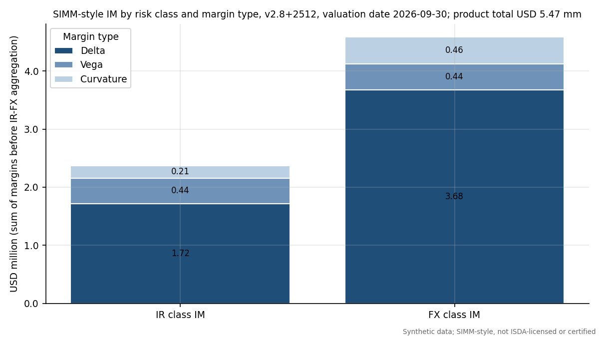

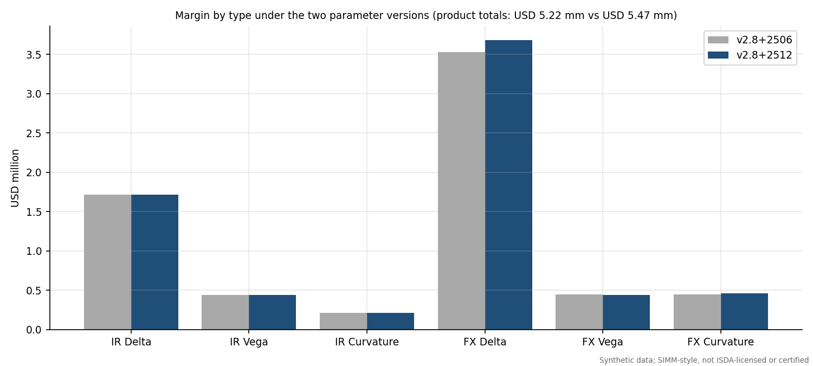

Adding the risk classes gives USD 6,952,028 and the IR-FX correlation reduces it to USD 5,465,781, a diversification benefit of USD 1,486,247. The 2512 version is higher than 2506 by USD 249,220 and the whole difference comes from the FX parameters (risk weight 7.4 against 7.1, vega parameters, FX concentration thresholds and the larger IR-FX correlation); the IR margins are identical because the IR parameters did not change.

## Parameter provenance

The parameter file `data/parameters/simm_parameters.csv` has 685 rows (342 for v2.8+2512 and 343 for v2.8+2506). Every row carries its source document, section, paragraph, table, PDF page, URL, retrieval date, the sha256 of the retrieved PDF and its verification status; all rows are VERIFIED_PRIMARY. They were transcribed from the public ISDA PDFs by two independent text extractors compared programmatically per table and then read against page images. No illustrative values are used for the in-scope parameters. Items still unverified: the ISDA credit, equity and commodity tables (out of scope), and the reading that IR vega uses the same tenor correlation matrix (the methodology text has no separate IR vega expiry correlation table, so this rests on the text and not on ISDA's calculator).

## Euler allocation

`allocation.euler_contributions` splits the IM among trades (or risk factors) by the directional derivative of the IM when that group's CRIF rows are scaled by $(1+\epsilon)$. When every concentration factor is 1, IM is homogeneous of degree one in the sensitivities, so by Euler's theorem the contributions sum exactly to the IM; with $CR > 1$ they do not, and `euler_check` reports the gap. The contributions are used in the dispute reconciliation (Section 11).

# Schedule IM, net-to-gross ratio and SIMM against the schedule

## The standardised schedule

The schedule route needs no model. Each trade's notional is multiplied by a rate that depends on the asset class and, for interest rates, the duration; the results are summed to the gross IM $G$. For the interest rate class the BCBS-IOSCO and US schedules give 1% for 0 to 2 years, 2% for 2 to 5 years and 4% for 5 years and above; FX is 6%; the US rule also has explicit cross-currency swap rows of 1%, 2% and 4% by duration (BCBS-IOSCO April 2020, Appendix A; the cross-currency rows are in 12 CFR Part 45, Appendix A, not in the BCBS-IOSCO appendix). The engine reads these from `data/parameters/schedule_im.csv`. Implementation assumptions, stated in `schedule_im.py`: bucket edges are lower-inclusive (a 2-year trade is in the 2 to 5 bucket); a swaption's duration is expiry plus underlying tenor; and notionals are converted to USD at the market FX rate.

| Asset class | Schedule rate | Trades | USD notional (mm) | Gross IM (USD mm) |
|:---------------|------------:|-----:|----------------:|----------------:|
| Foreign exchange | 6% | 8 | 145.8 | 8.74 |
| Interest rate | 2% | 2 | 87.8 | 1.76 |
| Interest rate | 4% | 10 | 301.9 | 12.08 |

Table: Gross schedule IM of the sample book by asset class and rate.

## Netting through the NGR

The schedule gives only partial credit for netting:
$$ \text{Net IM} = 0.4\,G + 0.6\,\text{NGR}\,G , \qquad \text{NGR} = \frac{\max\left(\sum_i MtM_i, 0\right)}{\sum_i \max(MtM_i, 0)} , $$
the ratio of net to gross current replacement cost, set to 1 when gross replacement cost is zero (12 CFR Part 45, Appendix A, footnote 1). Intuition: if all trades have positive value for the receiver, nothing offsets and NGR = 1; if positive and negative values cancel completely, NGR = 0 and the net IM falls to 40% of gross. For the sample book the net value is USD 11,681,326 and the sum of positive values is USD 15,716,628, so NGR = 0.743. The gross IM is USD 22,577,637 and the net IM is USD 19,099,501, which is 84.6% of gross.

## SIMM against the schedule

The comparison on four dates (the first and last dates of the history, the middle of the stress window and the scenario day):

| Date label | Date | SIMM-style (USD mm) | Schedule gross (USD mm) | NGR | Schedule net (USD mm) | SIMM / schedule net |
|:----------------|----------:|------------------:|----------------------:|----:|--------------------:|------------------:|
| first date | 1 Oct 2018 | 4.53 | 22.60 | 0.508 | 15.93 | 28.5% |
| stress window mid | 23 Aug 2019 | 3.72 | 19.89 | 0.259 | 11.05 | 33.7% |
| scenario day | 10 Jul 2026 | 5.26 | 22.48 | 0.706 | 18.52 | 28.4% |
| last date | 30 Sep 2026 | 5.47 | 23.50 | 0.743 | 19.88 | 27.5% |

Table: SIMM-style IM and schedule IM on four dates.

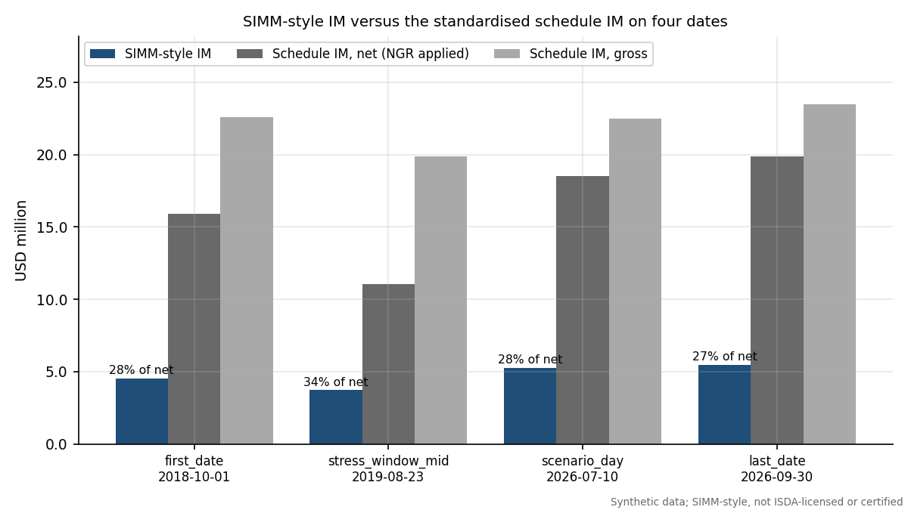

SIMM is far below the schedule: between 27.5% and 33.7% of the net schedule amount on these dates, and 24.2% of the gross schedule at the valuation date. This is the expected direction (a risk-sensitive model that recognises offsets should be cheaper than a flat conservative schedule, which is the reason firms seek model approval), and the magnitude is plausible, but it comes with two caveats. First, the sample is a hedged, mixed book where offsets are strong. Second, the IM here has not been calibrated against real stressed data. The schedule in this project is a benchmark and a ceiling to compare against, not a validated floor. Had SIMM exceeded the schedule, the pipeline would have raised a finding and not adjusted any number.

# Historical-simulation VaR IM and the calibration window

## The idea

SIMM is a parametric approximation. The alternative is to simulate: take the changes in market risk factors that actually happened in a history window, apply them to today's market, fully revalue the portfolio under every scenario, and read off the 99th percentile of the loss. This is historical simulation (HS), and `var_model.hs_im` implements it. It is used here as the champion model for the VaR IM backtest, because its design (99 percent, 10-day, stress included, equally weighted) is exactly the one the regulations describe, and as the benchmark that SIMM is compared with.

For a date $t$ and horizon $h$ days, scenario $s$ in the window applies the $h$-day change of every factor observed in that scenario's period: additive changes to par and zero rates and the cross-currency basis, and multiplicative (log) changes to FX spots, normal vols and FX vols. The loss under the scenario is
$$ L_s = -\left[ V(\text{state}_t \oplus \Delta_s) - V(\text{state}_t) \right] , $$
with full revaluation of every trade (no sensitivity approximation), and the IM is the 99th percentile of $\{L_s\}$ under the inverted CDF convention. Overlapping $h$-day changes are used, so a 750-day window has 750 scenarios.

## The calibration window in the EU style

The window follows the pattern of Article 16 of the EU regulation (Delegated Regulation (EU) 2016/2251, Article 16): the newest `config.WINDOW_DAYS` = 750 days, with equal weights, in which the oldest recent days are replaced by days from the stress window until at least 25 percent of the window is stressed (stressed meaning the regime label is stress, or the day comes from the forced stress window). The code, `stress_replacement`, finds for each date the smallest number $m$ of replacements that reaches the 25 percent target. Over the backtest period (from 30 Aug 2021) the window keeps on average 738.9 recent days and adds 11.1 stress-window days; replacement was needed on 20.0% of dates (at most 119 days). The stressed share of the window ranges from 25.1% to 56.4% and averages 39.6%. When the recent history is itself stressed enough, nothing is replaced, which is the intended behaviour: the stress requirement is a floor, not an overlay.

## Challenger models

Backtesting a single model tells you only whether it passes. To check that the tests can fail, three deliberately weaker challengers are built from the same revaluation matrix:

* **EWMA:** the newest 250 scenarios weighted by $\lambda^{age}$ with $\lambda = 0.97$, so recent scenarios dominate and stress memory fades.
* **Plain 250-day:** the newest 250 scenarios, equally weighted, with no stress replacement.
* **Champion times 0.7:** the champion IM scaled down by 30 percent, an under-margining model on purpose.

The champion's average 1-day IM over the backtest is USD 1.28 mm and its average 10-day IM is USD 3.93 mm, against USD 4.12 mm for the SIMM-style series.

## The SIMM-style series as a model under test

SIMM itself is backtested too: `var_model.daily_simm_series` builds a CRIF and a SIMM IM on every date from that date's market with parameter set v2.8+2512 (using the Jacobian method, so the cost is manageable). Its 10-day IM is compared with the 10-day loss of the frozen book. SIMM is less responsive to the market than HS: its standard deviation over the period is USD 0.49 mm against USD 0.91 mm for the champion 10-day IM, and the correlation of the two series is only 0.02. This is a feature of a fixed-parameter, sensitivity-based method (the sensitivities change with the market but the weights do not), and it matters in the Christoffersen tests below.

# Backtesting theory

## Exceptions and what a backtest tests

A VaR model at confidence 99% claims that a loss exceeds the forecast on 1% of days. An **exception** (or breach) on day $t$ is $I_t = 1$ if the realised loss exceeds the forecast made at the start of the day, else 0. If the model is right, $\{I_t\}$ is a sequence of independent Bernoulli variables with success probability $p = 1 - 0.99 = 0.01$. A good backtest therefore checks two things: the proportion of exceptions (unconditional coverage) and whether they are independent over time (no clustering). The sequence of forecasts must be made before the outcome is known; the engine's IM at date $t$ uses only information up to $t$.

**The P&L definition.** The loss is hypothetical: the revaluation of the same frozen trades one or ten days later with constant time to maturity. There are no cash flows, no ageing, no trading. This isolates the market-risk model from operational noise, which is how ISDA and the regulators describe the cleanest test, but it ignores the real behaviour of a live portfolio (finding F-06). BCBS 22 also stresses that backtests should be run on one-day measures, because over ten days portfolio composition changes (BCBS 22, Section II). For that reason the 1-day test is the primary one for the VaR IM, and the 10-day results are reported on two designs, described below.

## Kupiec's proportion of failures test

Let $n$ be the number of observations and $x$ the number of exceptions. Under the null, $x \sim \text{Binomial}(n, p)$. The likelihood ratio between the null and the best-fitting rate $\hat p = x/n$ is
$$ LR_{POF} = -2 \ln\!\left[(1-p)^{n-x}\, p^{x}\right] + 2 \ln\!\left[\left(1-\tfrac{x}{n}\right)^{n-x}\left(\tfrac{x}{n}\right)^{x}\right] , $$
asymptotically $\chi^2$ with one degree of freedom (Kupiec 1995, J. Derivatives vol 3 no 2, 73-84). With the convention $0 \ln 0 = 0$ it is also defined when $x = 0$. The test rejects both too many and too few exceptions: a model that is far too conservative fails as well. At $n = 250$ and $x = 0$ the statistic is 5.0252 with p-value 0.0250, which is below 5%, so even a perfectly safe-looking year with no exceptions rejects the hypothesis of exactly 1% coverage.

**Worked example (champion, 1 day).** With $n = 1,327$ and $x = 18$ the observed rate is $\hat p = 1.356%$ against $p = 1\%$, and the expected number of exceptions is 13.27. The log likelihoods are
$$ \ln L_0 = (n-x)\ln 0.99 + x \ln 0.01 = -96.049 , \qquad \ln L_1 = (n-x)\ln(1-\hat p) + x \ln \hat p = -95.283 , $$
so $LR_{POF} = 2(\ln L_1 - \ln L_0) = 1.5322$. The 5% critical value of $\chi^2_1$ is 3.841; the statistic is below it, and the p-value is 0.2158. Kupiec does not reject. This matches the engine and the table of results (the build asserts it).

The formula was checked against Federal Reserve restatements and independent numeric references (closed forms at $x = 0$ and $x = n$, a likelihood-ratio computed with `scipy.stats.binom.logpmf`, a simulation of the test size); the original paper could not be retrieved. The 250-day version over-rejects because the binomial is discrete: the exact rejection rate at nominal 5% is 9.5% for $n = 250$, 5.5% for $n = 1000$ and 4.4% for $n = 2500$.

## Christoffersen's independence and conditional coverage tests

Kupiec ignores timing. A model whose exceptions all fall in one week may have the right count but is clearly wrong: it fails to react when volatility jumps. Christoffersen tests this with a first-order Markov alternative (Christoffersen 1998, International Economic Review vol 39 no 4, 841-862). Count the transitions between consecutive days: $n_{ij}$ is the number of days with state $j$ following state $i$ (0 = no exception, 1 = exception). Estimate $\hat\pi_{01} = n_{01}/(n_{00}+n_{01})$, $\hat\pi_{11} = n_{11}/(n_{10}+n_{11})$ and the overall $\hat\pi = (n_{01}+n_{11})/n$. The independence statistic compares the Markov likelihood with the single-probability one:
$$ LR_{ind} = -2\ln\left[(1-\hat\pi)^{n_{00}+n_{10}}\hat\pi^{\,n_{01}+n_{11}}\right] + 2\ln\left[(1-\hat\pi_{01})^{n_{00}}\hat\pi_{01}^{\,n_{01}}(1-\hat\pi_{11})^{n_{10}}\hat\pi_{11}^{\,n_{11}}\right] \sim \chi^2_1 , $$
and the conditional coverage statistic combines both properties, $LR_{cc} = LR_{POF} + LR_{ind} \sim \chi^2_2$.

**Worked example (champion, 1 day).** The transition counts are $n_{00} = 1,292$, $n_{01} = 16$, $n_{10} = 16$, $n_{11} = 2$. So $\hat\pi_{01} = 1.223%$ (an exception follows a quiet day with that probability), $\hat\pi_{11} = 11.11%$ (9.1 times higher: after an exception the next day is much more likely to be another one) and $\hat\pi = 1.357%$. These give $LR_{ind} = 5.260$ and a p-value of 0.0218, below 5% but above 1%, hence an AMBER light. The conditional coverage statistic is $LR_{cc} = 1.532 + 5.260 = 6.792$ with $\chi^2_2$ p-value 0.0335, also AMBER. The champion has the right number of exceptions but they cluster (2 pairs of consecutive-day exceptions in a sample where independence would predict about 0.13).

## Basel traffic light

BCBS 22 sorts the number of exceptions among 250 observations into zones using the cumulative binomial probability at 99% coverage: the yellow zone starts where the probability of that many exceptions or fewer reaches 95%, and the red zone where it reaches 99.99% (BCBS 22, January 1996, Section III(c)). Table 2 of the paper, with the cumulative probabilities recomputed here with `scipy.stats.binom(250, 0.01)`:

| Exceptions in 250 days | Zone | Plus factor (BCBS 22 Table 2) | Cumulative binomial probability (recomputed) |
|:---|:---|---:|---:|
| 0 | Green | 0.00 | 8.11% |
| 1 | Green | 0.00 | 28.58% |
| 2 | Green | 0.00 | 54.32% |
| 3 | Green | 0.00 | 75.81% |
| 4 | Green | 0.00 | 89.22% |
| 5 | Yellow | 0.40 | 95.88% |
| 6 | Yellow | 0.50 | 98.63% |
| 7 | Yellow | 0.65 | 99.60% |
| 8 | Yellow | 0.75 | 99.89% |
| 9 | Yellow | 0.85 | 99.97% |
| 10 or more | Red | 1.00 | 99.99% |

Table: BCBS 22 Table 2 for 250 observations (green 0 to 4, yellow 5 to 9, red 10 or more). The plus factor is the increase in the capital multiplier in the original market risk context; it is shown for completeness and is not a margin multiplier.

For other sample sizes the engine applies the same cumulative-probability rule, `backtest.basel_zone`. In margin practice the analogue of the plus factor is the SIMM shortfall: if SIMM under-margins, ISDA's framework allows a scaled-up margin (ISDA SIMM Governance Framework 18 Sep 2026). `backtest.shortfall_multiplier` finds the smallest $k$ such that $k \times$ IM would put the exception count in the green zone.

## Test lights

To summarise a battery of tests the engine uses three lights: PASS if the p-value is at least 0.05 and the zone is green; AMBER if the p-value is between 0.01 and 0.05, or the zone is yellow; RED if the p-value is below 0.01 or the zone is red. The overall light of a model-design combination is the worst of the Kupiec, Christoffersen-independence and Basel-zone lights. This is a house convention for readability, not a regulatory rule.

## The overlapping-window problem

For a 10-day IM there are two ways to backtest. Compare the IM with the loss over each of the next ten days on every date (overlapping windows: consecutive windows share nine of ten days), or only every tenth date (non-overlapping). Overlapping windows give about ten times more observations but they are not independent: one bad week appears in ten consecutive windows. Exceptions cluster, so the Christoffersen independence test rejects almost mechanically and the Kupiec test is over-sized. BCBS 22 warns specifically against comparing 10-day risk measures with overlapping 10-day outcomes (BCBS 22, Section II). The project therefore uses the non-overlapping design for the pass criterion and reports the overlapping design only as supporting evidence. It also has a price: the non-overlapping sample has only 132 observations, so the tests have low power, and results move with the starting offset.

# Backtest results

## Design

The 1-day tests use 1,327 daily observations from 30 Aug 2021 to 29 Sep 2026. The first valid date is set by the need for a full calibration window of 750 days plus the horizon. The 10-day designs use the same dates, either every date (overlapping, 1,318 observations) or every tenth (non-overlapping, 132).

## Champion, challengers and the SIMM-style series

| Model | Design | n | Exceptions | Expected | Kupiec p | Christoffersen ind p | Christoffersen cc p | Zone | Light |
|:---|:---|---:|---:|---:|---:|---:|---:|:---|:---|
| Champion HS IM (EU 1+3 window) | 1-day | 1,327 | 18 | 13.3 | 0.216 | 0.022 | 0.034 | Green | AMBER |
| Champion HS IM (EU 1+3 window) | 10-day non-overlapping | 132 | 2 | 1.3 | 0.580 | 0.803 | 0.832 | Green | PASS |
| Champion HS IM (EU 1+3 window) | 10-day overlapping | 1,318 | 31 | 13.2 | 2.7e-05 | 2.7e-34 | 6.2e-37 | Red | RED |
| EWMA challenger | 1-day | 1,327 | 31 | 13.3 | 3.1e-05 | 0.203 | 7.5e-05 | Red | RED |
| EWMA challenger | 10-day non-overlapping | 132 | 6 | 1.3 | 0.003 | 0.249 | 0.006 | Yellow | RED |
| EWMA challenger | 10-day overlapping | 1,318 | 66 | 13.2 | 1.5e-25 | 8.2e-56 | 3.2e-78 | Red | RED |
| Plain 250-day challenger | 1-day | 1,327 | 24 | 13.3 | 0.008 | 0.453 | 0.022 | Yellow | RED |
| Plain 250-day challenger | 10-day non-overlapping | 132 | 6 | 1.3 | 0.003 | 0.249 | 0.006 | Yellow | RED |
| Plain 250-day challenger | 10-day overlapping | 1,318 | 44 | 13.2 | 1.8e-11 | 8.1e-53 | 2.4e-61 | Red | RED |
| Champion x 0.7 challenger | 1-day | 1,327 | 54 | 13.3 | 2.9e-17 | 3.3e-05 | 5.7e-20 | Red | RED |
| Champion x 0.7 challenger | 10-day non-overlapping | 132 | 6 | 1.3 | 0.003 | 0.448 | 0.008 | Yellow | RED |
| Champion x 0.7 challenger | 10-day overlapping | 1,318 | 58 | 13.2 | 5.5e-20 | 5.4e-58 | 6.9e-75 | Red | RED |
| SIMM-style | 10-day non-overlapping | 132 | 1 | 1.3 | 0.770 | 0.901 | 0.951 | Green | PASS |
| SIMM-style | 10-day overlapping | 1,318 | 14 | 13.2 | 0.822 | 4.0e-23 | 4.9e-22 | Green | RED |

Table: Backtest battery. Expected exceptions are 1% of n. Zone is the BCBS 22 zone of the exception count. Light is the worst of the three lights defined above.

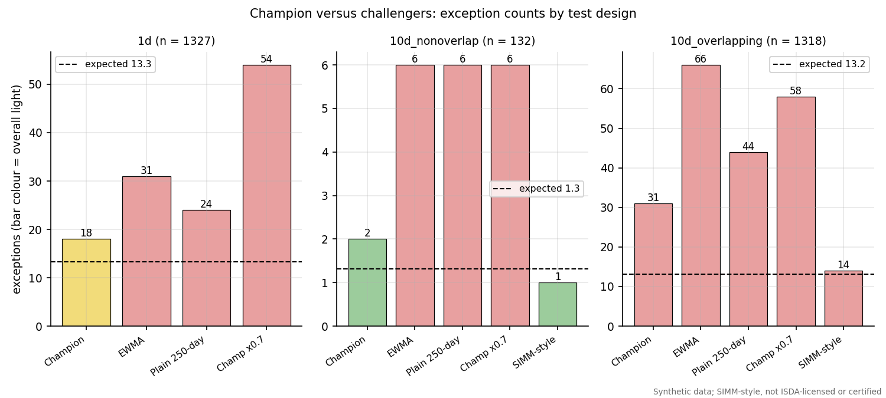

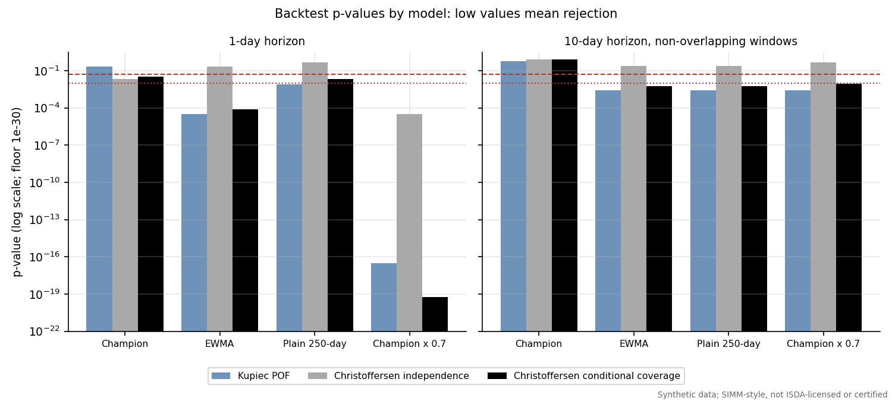

**Reading the table.** Four observations stand out.

1. *The champion is good but not clean.* At one day it has 18 exceptions against 13.3 expected, passes Kupiec (p = 0.216) and the Basel zone test on the full sample, but fails to be independent (p = 0.022), so the overall light is amber. On 10-day non-overlapping windows it passes everything (2 exceptions, Kupiec p = 0.580).
2. *Challengers are worse, so the tests have power.* The EWMA model (31 exceptions), the plain 250-day model (24) and the champion scaled by 0.7 (54) are all red overall at one day, and all are red on the 10-day non-overlapping design (6, 6 and 6 exceptions in 132 against 2 for the champion). The scaled model's p-values are astronomically small, as they should be for a model that deliberately takes 30 percent too little margin. The result also shows why stress replacement matters: the plain 250-day model has no stress memory and under-margins when volatility returns.
3. *Overlapping windows reject everything.* All HS models are red on overlapping windows, including the champion (31 exceptions, Christoffersen independence p = 2.7e-34). This is the artefact described above, not evidence that the champion is wrong, and it is the reason the non-overlapping design is the pass criterion.
4. *SIMM-style: passes one design and fails another.* On non-overlapping windows the SIMM-style series has 1 exception in 132 (overall pass; note that this is below the 1.3 expected, on the safe side). On overlapping windows its Kupiec p-value is 0.822 (14 exceptions against 13.2 expected, almost exactly the right rate) but Christoffersen independence is rejected (p = 4.0e-23): its exceptions come in clusters, as every overlapping design's do. The shortfall multiplier of the SIMM-style series is 0.905, below 1, meaning no scale-up would be needed under the Basel rule; the champion's multiplier is 1.142.

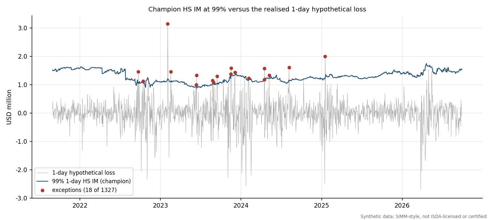

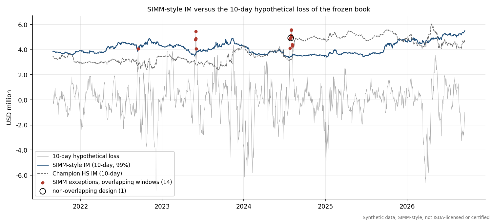

## Rolling 250-day counts and the traffic light

The regulatory traffic light is applied to windows of 250 days, so the relevant question is how many exceptions fall in any trailing 250-day window.

| Model | Exceptions in the last 250 days | Zone (last 250) | Maximum over all rolling 250-day windows | Zone (maximum) |
|:---|---:|:---|---:|:---|
| Champion HS IM (EU 1+3 window) | 0 | Green | 12 | Red |
| EWMA challenger | 7 | Yellow | 13 | Red |
| Plain 250-day challenger | 4 | Green | 10 | Red |
| Champion x 0.7 challenger | 2 | Green | 30 | Red |

Table: BCBS 22 zone of the most recent 250 days and of the worst rolling 250-day window, one-day champion and challengers.

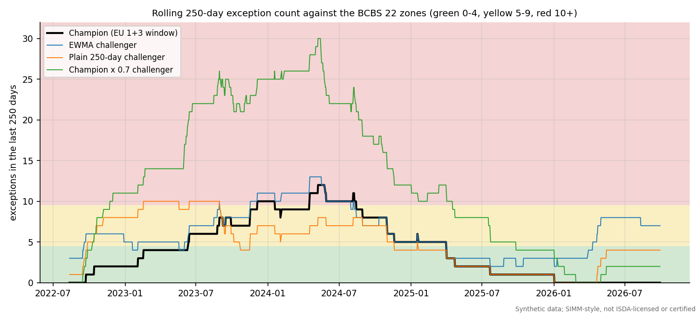

The champion's last 250 days contain 0 exceptions (green), but its worst window, ending 8 May 2024, contains 12, which is in the red zone (10 or more). Across the 1,078 complete rolling windows the champion is red in 11.0%, yellow in 32.7% and green in 56.3%. This is a real weakness: under a strict reading of the traffic light the champion would have been flagged red for a part of the sample. The champion's exceptions run from 23 Sep 2022 to 17 Jan 2025 and cluster in between.

## Behaviour by regime

| Regime | Days | Exceptions | Exception rate | Kupiec p-value |
|:-----|---:|---------:|-------------:|-------------:|
| calm | 860 | 0 | 0.00% | 3.2e-05 |
| stress | 467 | 18 | 3.85% | 2.3e-06 |

Table: Champion one-day exceptions by regime.

The champion has 0 exceptions in 860 calm days (about 8.6 expected) and 18 in 467 stress days (rate 3.85%, nearly four times the 1% target). Of the exceptions, all occur in the stress regime. The Kupiec p-value is small in both regimes for opposite reasons: in calm periods the model is too conservative (zero exceptions), in stress periods too aggressive. That is the typical profile of a window-based VaR: it carries stress memory that over-protects in calm markets and reacts too slowly when volatility rises. The worst single day is 3 Feb 2023, when the 1-day loss of USD 3.14 mm exceeded a forecast of USD 1.20 mm.

## What to conclude

For a margin model the cost of an exception is that the counterparty is under-collateralised on that day; the cost of excess conservatism is funding and liquidity. The champion is calibrated to the right level overall and clearly better than all the challengers, but its time profile (cluster of exceptions, red worst window, regime asymmetry) means that a validator would approve it only with conditions: a monitoring trigger on the rolling count, a stress add-on or floor in high-volatility regimes, and a note on the sample (synthetic, one book). The same reasoning applies to the SIMM-style series, whose results are good on the preferred design and weaker on the supporting one. These are exactly the nuances of a real validation report.

# xVA VaR: CVA and its backtest

## The CVA model

Credit valuation adjustment (CVA) is the market value of the counterparty's default risk on the netting set. Unilateral CVA with loss given default $LGD = 1 - R$ and recovery $R = 40\%$ is
$$ CVA = LGD \sum_k \tfrac12\left[EE(t_{k-1})DF(t_{k-1}) + EE(t_k)DF(t_k)\right]\left[Q(t_{k-1}) - Q(t_k)\right] , $$
where $EE$ is the expected positive exposure at time $t_k$, $DF$ the discount factor and $Q(t)$ the counterparty's survival probability. The sum is a trapezoid approximation to $\int EE\, DF\, dPD$ on a quarterly grid. `cva.py` has three parts.

* **Hazard curve.** A piecewise-constant hazard rate is bootstrapped from the CDS spreads at 1, 3, 5, 7 and 10 years so that each par CDS reprices exactly (`bootstrap_hazard`, bisection over states). At the valuation date the hazard rates are 1.24% (to 1 year), 2.06%, 3.08%, 3.46% and 3.66% per year for the successive pillars.
* **Exposure.** For the linear trades (13 of 20: the swaps and forwards) the netting-set value at a future time $t_k$ is approximated as Gaussian with mean $\mu_k$ (the forward value of the remaining cash flows) and variance $s_k^2 = t_k\, d_k' \Sigma\, d_k$, where $d_k$ are the sensitivities of $\mu_k$ to nine factors (a parallel shift of each of the five zero curves, and the log spot of the four non-USD currencies) and $\Sigma$ is their annualised covariance estimated from the trailing 250 days of the history. Then $EE = \mu\Phi(\mu/s) + s\,\phi(\mu/s)$, the expectation of $\max(V, 0)$ for a normal $V$. The factor volatilities estimated from the history are below.
* **Excluded trades.** Swaptions and FX options are excluded because their exposure is not Gaussian. They carry 43.4% of the book's absolute PV, so this is a material limitation (finding F-05). A Monte Carlo exposure engine would replace it.

| Currency | Parallel zero-rate volatility (bp per year) | FX volatility against USD (percent per year) |
|:---|---:|---:|
| USD | 97.1 | none (calculation currency) |
| EUR | 87.1 | 12.0 |
| GBP | 86.8 | 12.7 |
| JPY | 30.3 | 13.5 |
| MXN | 124.6 | 17.5 |

Table: Annualised factor volatilities used in the exposure model at the valuation date.

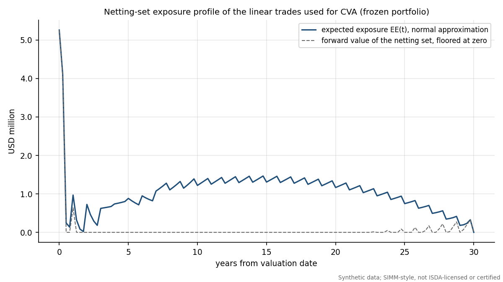

At the valuation date the CVA is USD 225,687, the expected positive exposure averaged over the life is USD 1,022,381 and the peak EE is USD 5,259,153. The profile starts high because short-dated FX forwards are in the money and falls sharply as they mature, then rises again with the diffusion of the long swaps.

## The xVA VaR model and its backtest

CVA moves with credit spreads, interest rates and FX. A risk team therefore wants a VaR on the change of CVA. The model in `xva_var_series` is sensitivity-based historical simulation: bump each of five CDS pillars (CS01), each of five parallel rate levels and each of four FX spots, reprice CVA to get 14 sensitivities, apply the newest 750 days of $h$-day factor changes, and take the 99th percentile of the resulting loss distribution. The backtest compares it with the realised full-revaluation change in CVA (model parameters held at the date-$t$ values so the test isolates market moves):

| Design | n | Exceptions | Expected | Kupiec p | Christoffersen ind p | Christoffersen cc p | Zone | Light |
|:---|---:|---:|---:|---:|---:|---:|:---|:---|
| 1-day | 1,327 | 15 | 13.3 | 0.640 | 0.558 | 0.755 | Green | PASS |
| 10-day non-overlapping | 132 | 4 | 1.3 | 0.059 | 0.089 | 0.040 | Yellow | AMBER |
| 10-day overlapping | 1,318 | 30 | 13.2 | 6.6e-05 | 2.5e-30 | 1.3e-32 | Red | RED |

Table: xVA VaR backtest.

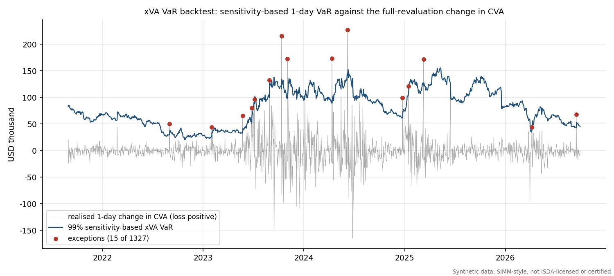

At one day the xVA VaR passes all tests: 15 exceptions in 1,327 (Kupiec p = 0.640, Christoffersen conditional coverage p = 0.755). On 10-day non-overlapping windows it has 4 exceptions in 132 and conditional coverage is amber (p = 0.040); the overall light is amber, raised as finding F-11. The overlapping design is red, as for the IM models. The model is a first-order approximation: the sensitivities are linear, gamma and the exposure profile's sensitivity to volatility are ignored, and the realised CVA uses the same Gaussian exposure model, so the test checks the VaR approximation to the CVA model, not the CVA model to reality.

# Margin dispute investigation

## The business problem

Each day both counterparties compute IM for the same netting set and the delivering party's number is called. If the receiving party's number differs by more than an agreed threshold, there is a dispute, and both sides have to find out why. ISDA's governance framework prescribes escalation steps for such disputes, and in practice the work is a structured reconciliation: do we agree on the trade population, on the sensitivities, on the parameters and on the aggregation? (ISDA SIMM Governance Framework 18 Sep 2026). The first three are data problems; the last is a model problem and should rarely differ if both sides run the same version.

## The simulator

`dispute.py` plays both sides. Party A is the base calculation (the CRIF and parameters of Section 4 and 5). `make_counterparty_view` builds party B's inputs with one seeded difference, scenario D1 to D9, all at the scenario day 10 Jul 2026 (the first COB on which v2.8+2512 applies):

| Scenario | Seeded difference on party B's side |
|:---|:---|
| D1 | A trade (IRS_EUR_10Y) was never booked |
| D2 | The notional of IRS_USD_10Y was amended by +10% |
| D3 | IR delta computed per 1bp of zero rate instead of per 1bp of par quote |
| D4 | FX vega weighted with the market implied vol instead of the SIMM vol |
| D5 | Local amounts converted to USD at an FX rate five business days old |
| D6 | The 7-year IRS sensitivity mapped 100% to the 10-year vertex instead of linear rebucketing |
| D7 | The curves are three business days old |
| D8 | Party B is on parameter version v2.8+2506 |
| D9 | D1 and D5 together |

## The reconciliation

`reconcile` compares the two views at four levels, from the cheapest check to the most expensive.

1. **Trade population:** trade IDs and notionals on each side (only A, only B, notional differs).
2. **CRIF key match:** an outer join on TradeID, RiskType, Qualifier, Label1, Label2 with a tolerance on AmountUSD (USD 1 absolute or $10^{-9}$ relative); each key is matched, differs in amount, only A or only B.
3. **Hierarchical IM gap:** the difference in IM between B and A decomposed down the SIMM tree: risk class, margin type, bucket ($K_b$), risk factor. The decomposition follows the largest absolute gap at each level, which localises the break.
4. **Euler contributions:** each trade's contribution to IM on each side, to see which trades explain the gap even when sensitivities are aggregated.

Example, D1 (gap USD -224,174, IM A USD 5,264,394, IM B USD 5,040,220):

| Level | Item | Party A (USD) | Party B (USD) | Gap (USD) |
|:---|:---|---:|---:|---:|
| Risk class | IR | 2,579,983 | 2,279,851 | -300,133 |
| Risk class | FX | 4,218,141 | 4,166,131 | -52,009 |
| Margin type | IR Delta | 1,732,462 | 1,432,330 | -300,133 |
| Margin type | FX Delta | 3,213,853 | 3,161,844 | -52,009 |
| Bucket K | IR Delta EUR | 1,503,105 | 509,866 | -993,239 |
| Bucket K | FX Delta FX | 3,213,853 | 3,161,844 | -52,009 |
| Bucket K | FX Curvature FX | 77,562 | 77,562 | 0 |

Table: Scenario D1, gap decomposition from risk class down to buckets (top items).

| Trade | Euler contribution A (USD) | Euler contribution B (USD) | Gap (USD) |
|:---|---:|---:|---:|
| SWPT_EUR_4Yx10Y | 951,749 | 460,940 | -490,809 |
| IRS_EUR_10Y | 484,966 | 0 | -484,966 |
| IRS_EUR_5Y | -299,663 | 130,354 | 430,018 |
| IRS_GBP_7Y | 254,431 | 487,039 | 232,609 |

Table: Scenario D1, largest trade-level differences in Euler contribution. The missing trade IRS_EUR_10Y has contribution zero on B's side.

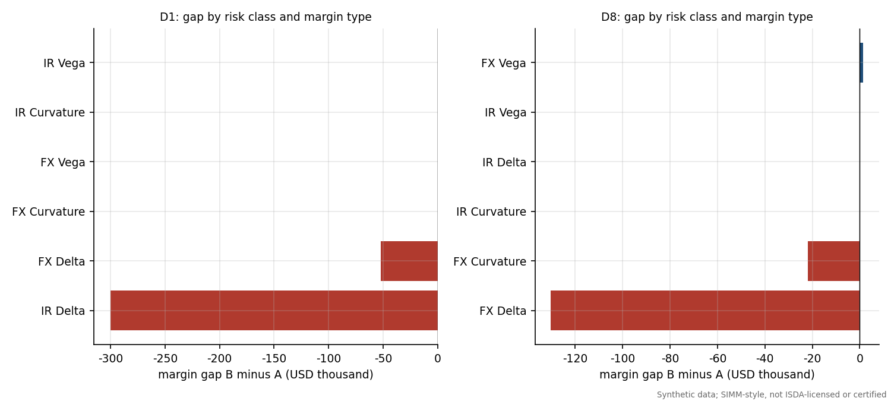

## Ranking the causes

The ranking step turns the reconciliation into a hypothesis test. `rank_causes` has eight hypotheses (the causes in D1 to D8). For each one it applies the counterfactual fix to B (for example: add the missing trades, restore the notionals, rebuild the delta rows from par quotes, re-weight FX vega with the SIMM vol, convert with today's FX, use linear rebucketing, rebuild from today's curves, switch parameter version), recomputes B's IM, and ranks hypotheses by the residual gap left. Ties within the tolerance are broken in favour of the fix that touches fewer CRIF rows (the narrower explanation), and a signature score reports the share of reconciliation breaks that the fix removes. This implements the principle that the right explanation is the one that, when undone, makes the numbers agree.

| Scenario | Seeded cause | Rank(s) | IM A (USD) | IM B (USD) | Gap B minus A (USD) | Top-ranked cause | Residual after top fix (USD) | Accepted |
|:---|:---|:---|---:|---:|---:|:---|---:|:---|
| D1 | missing trade | 1 | 5,264,394 | 5,040,220 | -224,174 | missing trade | 0 | yes |
| D2 | notional amendment | 1 | 5,264,394 | 5,269,689 | 5,295 | notional amendment | 0 | yes |
| D3 | zero-rate instead of par delta | 1 | 5,264,394 | 5,275,981 | 11,587 | zero-rate instead of par delta | 0 | yes |
| D4 | FX vega at implied vol | 1 | 5,264,394 | 5,109,601 | -154,793 | FX vega at implied vol | 0 | yes |
| D5 | stale FX rate | 1 | 5,264,394 | 5,249,408 | -14,986 | stale FX rate | 0 | yes |
| D6 | no linear rebucketing | 1 | 5,264,394 | 5,244,840 | -19,555 | no linear rebucketing | 0 | yes |
| D7 | stale curve | 1 | 5,264,394 | 5,266,020 | 1,625 | stale curve | 0 | yes |
| D8 | parameter version 2506 | 1 | 5,264,394 | 5,029,888 | -234,506 | parameter version 2506 | 0 | yes |
| D9 | missing trade plus stale FX rate | 1+3 | 5,264,394 | 5,036,440 | -227,955 | missing trade | 9,040 | yes |

Table: Dispute scenarios. Rank(s) is the rank of the seeded cause (both causes for D9). Accepted means rank 1 for D1 to D8 and both causes within the top three for D9.

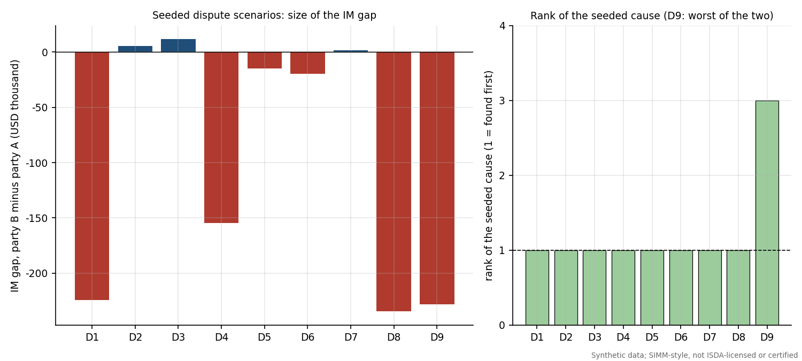

**Result.** 9 of 9 scenarios were accepted. The absolute gap ranges from USD 1,625 (D7, the stale curve, is the smallest) to USD 234,506 on an IM of about USD 5,264,394. All single-cause scenarios have the seeded cause at rank 1 with a residual of zero after the fix.

**Tie in D4.** The ranking in D4 shows why the narrower-fix rule is needed:

| Hypothesis | Signature score | Explained gap (USD) | Residual after fix (USD) | CRIF rows in scope | Rank |
|:---|---:|---:|---:|---:|---:|
| FX vega at implied vol | 1.000 | 154,793 | 0 | 4 | 1 |
| stale curve | 1.000 | 154,793 | 0 | 96 | 2 |
| missing trade | 0.000 | 0 | 154,793 | 0 | 3 |

Table: Scenario D4, top of the ranking.

Rebuilding the whole CRIF from today's curves ("stale curve") also removes the difference, because it regenerates the FX vega rows with the correct convention; but it touches 96 rows while the FX vega fix touches 4. Without the tie-break the engine would report a wrong cause.

**The composite case D9.** With two causes at once the ranking is harder, because the larger break masks the smaller one:

| Hypothesis | Signature score | Explained gap (USD) | Residual after fix (USD) | CRIF rows in scope | Rank |
|:---|---:|---:|---:|---:|---:|
| missing trade | 0.219 | 218,915 | 9,040 | 6 | 1 |
| no linear rebucketing | 0.125 | 6,789 | 221,165 | 15 | 2 |
| stale FX rate | 0.781 | 3,781 | 224,174 | 39 | 3 |
| stale curve | 0.781 | 3,781 | 224,174 | 90 | 4 |
| notional amendment | 0.000 | 0 | 227,955 | 0 | 5 |

Table: Scenario D9, top of the ranking (missing trade plus stale FX rate).

The missing trade is rank 1 and explains USD 218,915 of the gap; the stale FX rate ranks only 3, behind a spurious "no linear rebucketing" hypothesis, because its stand-alone effect (USD 3,781) is small and it overlaps with other rows; a residual of USD 9,040 remains after the top fix. The acceptance rule for composites (both causes in the top three) is met, but the example shows the usual lesson: fix the biggest break, re-run, and look again. This is also a limitation (Section 16): the ranking assumes a single dominant cause and a fixed hypothesis list.

# IM attribution

## The business problem

Every morning the IM call changes, and the first question from the desk is why. The change comes from different sources: trades that matured, trades that were booked, market moves and, on rare dates, a change in the SIMM parameters (the move from v2.8+2506 to v2.8+2512). The sources interact (a new trade changes the netting benefit of existing trades, a market move changes the sensitivities of the new trade), so a naive decomposition does not add up.

## Three methods

Let $IM(S)$ be the SIMM-style IM of the state in which the drivers in subset $S$ have been switched from their day-0 to their day-1 setting. With four drivers there are 16 states, all computed by `attribution.attribute`.

* **Shapley value.** The contribution of driver $i$ is its marginal effect averaged over all orders in which drivers can be switched on:
$$ \phi_i = \sum_{S \subseteq N\setminus\{i\}} \frac{|S|!\,(n-|S|-1)!}{n!}\,\left[IM(S\cup\{i\}) - IM(S)\right] . $$
It is the unique allocation that is symmetric and efficient: the contributions add up exactly to $IM(N) - IM(\emptyset)$.
* **Sequential bridge.** Switch drivers on in a fixed documented order: matured trades, new trades, then the market move split into rates, FX and vol, then parameters. Each step is valued after the previous ones, so the steps telescope to the total. It reads as a narrative ("first the maturities, then the new trade...") but depends on the order. The order chosen values trade changes at the old market and parameters, market moves on the new population, and the methodology change last, which is how a version-change impact is normally quoted.
* **One at a time.** Switch each driver alone from the base state. This is the simplest to compute and explain but ignores interactions, so the contributions do not add up and leave an interaction residual.

## Scenario day

The scenario day is 10 Jul 2026, the first COB of v2.8+2512. The designed move combines a stress-like market shock (parallel rate increases of 8 to 70 bp by currency, EUR, GBP and MXN weakening against USD, JPY strengthening, IR vol up 40% and FX vol up 60%), two 3-month trades that mature (FXF_USDJPY_3M, FXO_EURUSD_C3M), a new USD 150 million 10-year swap, and the parameter switch. IM moves from USD 4,970,798 to USD 9,011,268, a change of USD 4,040,470 (81.3%).

| Driver | Shapley (USD) | Share | Bridge (USD) | Share | One at a time (USD) |
|:---|---:|---:|---:|---:|---:|
| Matured trades | -691,528 | -17.1% | -914,221 | -22.6% | -914,221 |
| New trades | 4,674,898 | 115.7% | 4,964,959 | 122.9% | 4,576,775 |
| Market move | -146,711 | -3.6% | -183,276 | -4.5% | -127,877 |
| Parameter version | 203,811 | 5.0% | 173,007 | 4.3% | 231,658 |
| **Sum of drivers** | **4,040,470** |  | **4,040,470** |  | **3,766,335** |
| **Total change in IM** | **4,040,470** |  | **4,040,470** |  | **4,040,470** |
| Interaction residual | 0 |  | 0 |  | 274,134 |

Table: Attribution of the change in IM on the scenario day, three methods.

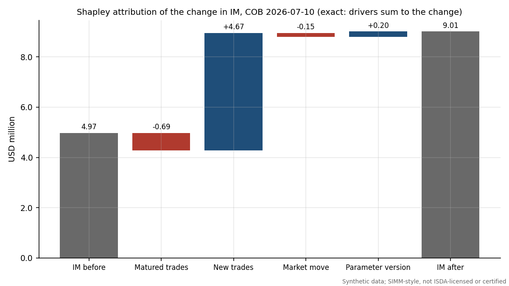

The new trade explains USD 4,674,898 (115.7% of the change); maturities change IM by USD -691,528; the market move changes IM by USD -146,711 (the bridge below splits it into rates, FX and volatility effects of opposite signs); and the parameter change adds USD 203,811. The three methods agree on the ranking but differ in size by up to a few hundred thousand USD, the signature of interactions. The one-at-a-time total misses USD 274,134 (6.8% of the change). Shapley and the bridge have zero residual by construction.

| Market sub-step (bridge) | Impact (USD) | Share of total change |
|:---|---:|---:|
| Rates (curves and basis) | -498,794 | -12.3% |
| FX spot | -95,145 | -2.4% |
| Volatilities | 410,663 | 10.2% |

Table: The bridge splits the market step into rates, FX and volatility. A large positive vol effect offset by negative rates and FX effects nets to a small total.

## A Shapley calculation by hand

The 16 subset IMs are in the output file `attribution_subset_ims.csv`. The Shapley value of the new trade needs the eight pairs of subsets that differ only in whether the new trade is included. With $n = 4$ drivers the weights are $0!\,3!/4! = 0.25$ for no other driver switched, $1!\,2!/4! = 1/12$ for one, $2!\,1!/4! = 1/12$ for two and $3!\,0!/4! = 0.25$ for all three.

| Other drivers already switched | IM without new trades (USD) | IM with new trades (USD) | Marginal effect (USD) | Weight | Weighted (USD) |
|:---|---:|---:|---:|---:|---:|
| none | 4,970,798 | 9,547,573 | 4,576,775 | 0.2500 | 1,144,194 |
| matured | 4,056,577 | 9,021,536 | 4,964,959 | 0.0833 | 413,747 |
| market | 4,842,921 | 9,273,759 | 4,430,838 | 0.0833 | 369,237 |
| matured + market | 4,101,151 | 8,838,260 | 4,737,109 | 0.0833 | 394,759 |
| version | 5,202,455 | 9,801,243 | 4,598,787 | 0.0833 | 383,232 |
| matured + version | 4,230,987 | 9,201,631 | 4,970,644 | 0.0833 | 414,220 |
| market + version | 5,061,974 | 9,508,134 | 4,446,160 | 0.0833 | 370,513 |
| matured + market + version | 4,271,284 | 9,011,268 | 4,739,984 | 0.2500 | 1,184,996 |
| **Shapley value of new trades** |  |  |  | **1.0000** | **4,674,898** |

Table: Shapley value of the new trades: the eight marginal effects with their weights. The weights sum to one and the weighted sum equals the Shapley value in the table above (USD 4,674,898).

Notice that the new trade adds between USD 4.43 mm and USD 4.97 mm of IM depending on what else has changed. That spread is the interaction; Shapley takes the fair average, one-at-a-time takes only the first row, and the bridge takes one specific row.

## Netting effect

A new trade's standalone IM (computed alone) is USD 7,072,990 but its incremental IM on the final book is USD 4,739,984. The difference, USD -2,333,006, is the netting effect: the new trade partly hedges existing risk, so adding it costs 33.0% less than its standalone number suggests. Reporting both avoids telling a trader that a hedging trade is as expensive as it would be on its own.

## Scanning the history for big moves

`run_scan` computes the SIMM-style IM for each of the 2,088 dates and flags days where the IM changed by more than 10 percent or USD 1 million in one day. Over the history the IM ranges from USD 3.34 mm to USD 5.57 mm (mean USD 4.27 mm) and the largest one-day move is 16.6% (USD 693,563). 5 days breach the relative trigger and 0 the absolute trigger. For flagged days the rates, FX and vol split of the move is computed:

| Date | IM (USD) | Change (USD) | Change (percent) | Rates (USD) | FX (USD) | Vol (USD) |
|:---|---:|---:|---:|---:|---:|---:|
| 28 Mar 2019 | 4,440,441 | 489,629 | 12.4% | -3,515 | 493,153 | -10 |
| 7 Aug 2019 | 4,046,792 | -505,138 | -11.1% | -23,266 | -482,585 | 713 |
| 13 Feb 2020 | 4,874,966 | 693,563 | 16.6% | 97,200 | 618,008 | -21,645 |
| 20 Jul 2020 | 5,108,658 | 599,025 | 13.3% | 100,855 | 472,808 | 25,363 |
| 27 Jun 2024 | 3,577,165 | -408,827 | -10.3% | -150,714 | -258,522 | 410 |

Table: The flagged days. All are dominated by FX moves, as the FX delta is the largest component of this book's IM.

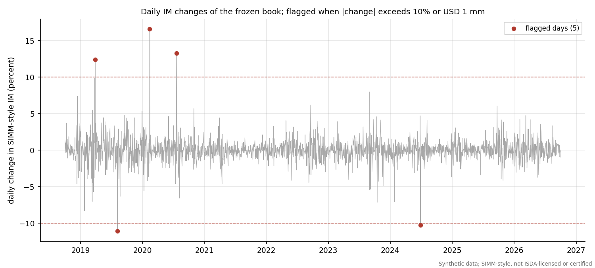

A related check, delta and vega sub-additivity (the margin of a combined portfolio should not exceed the sum of the margins of its parts), was run on 60 random splits per risk class and margin type, 360 checks in total, with 0 violations. Curvature margin is not sub-additive in general and the project reports rather than asserts it.

# UAT and new-product onboarding

## Why UAT

When a bank starts trading a new product, the margin calculation has to be extended and then accepted by the business before the first trade is booked: that is user acceptance testing. The scenario here is a 5-year EUR/USD cross-currency basis swap on EUR 50 million (USD notional at the initial FX rate) with `settle_notional_exchange` = "eligible", so the final principal exchange is excluded from the model IM following the cross-currency rule (12 CFR 45.8(d)(4)).

## The procedure

`uat.py` holds a machine-readable test suite (`data/uat/uat_suite.csv`) with the columns test id, area, description, preconditions, input, expected, tolerance, actual, result, evidence file, execution time and executor. `run_uat` executes every test on the synthetic market of the scenario day, fills `actual` and `result` honestly (PASS, FAIL or SKIPPED) and writes `uat_results.csv`. Expectations for the hand cases use the verified numbers of the verification log, not the parameter loader, so they are independent of the code under test. The tests cover pricing, sensitivities, CRIF format, SIMM treatment (the basis risk weight of 21 with no concentration scaling, exclusion from the concentration sum, the $-1\%$ basis-to-yield correlation), the principal exchange exclusion, the schedule row, invariants, dispute detection, the Excel workbook, runtime and a regression test.

| Test | Area | Check | Result |
|:---|:---|:---|:---|
| U01 | pricing | PV is zero at the market basis and spot | PASS |
| U02 | pricing | Vectorised PV equals leg-by-leg PV | PASS |
| U03 | sensitivities | Delta ladder sums to the parallel PV01 | PASS |
| U04 | sensitivities | Basis sensitivity equals notional x annuity x FX x 1bp | PASS |
| U05 | crif | CRIF columns, risk types and USD conversion | PASS |
| U06 | simm | Basis RW 21 with no CR scaling | PASS |
| U07 | simm | Basis excluded from the CR sum | PASS |
| U08 | simm | Basis to yield correlation of -1% (hand case) | PASS |
| U09 | crif | Principal exchange exclusion removes the principal FX delta | PASS |
| U10 | schedule | Schedule IM uses the cross-currency row | PASS |
| U11 | simm | Sign symmetry of delta and vega | PASS |
| U12 | simm | Homogeneity of IM in the CRIF amounts | PASS |
| U13 | simm | XCCY adds no vega or curvature | PASS |
| U14 | dispute | Missing XCCY detected and ranked first in a dispute | PASS |
| U15 | excel | Excel rows reconcile to Python | PASS |
| U16 | performance | Runtime within budget | PASS |
| U17 | regression | Existing IM unchanged when the XCCY is not booked | PASS |

Table: UAT results.

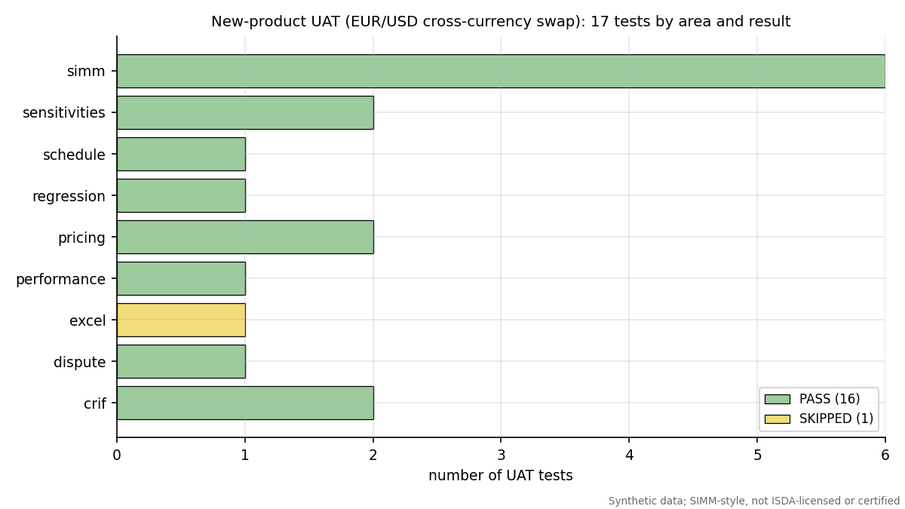

## Executed results

17 of 17 tests passed, 0 failed and 0 were skipped. Two examples with the evidence: U01 shows PV = 0 USD at basis -18.0008bp, initial FX 1.138793; U14 shows that a counterparty that has not booked the swap is detected and ranked first: gap -319948.2357 USD (IM_A 5584342.613, IM_B 5264394.378); rank 1 = missing_trade, residual 0; trade-population break XCCY_EURUSD_5Y. U16 recorded 1.419 s against budget 5 s (book plus XCCY IM 5584342.613 USD). The Excel test (U15) has the result PASS: excel_reconciliation.json: all_passed = True over 3 cases. Any failure would be reported as such and would raise a finding. The suite tests the engine against itself and against closed forms, so it shows internal consistency and not agreement with ISDA's calculator.

# Findings log

The validation findings are in `findings_log.csv` (`findings.build_log`), using the same schema as the credit model validation project: ID, area, title, description, evidence, evidence file, severity, traffic light, recommendation, owner, status and source. Backtest-driven findings are produced automatically (RED becomes High, AMBER becomes Medium); static findings record known limitations. There are 17 findings: 2 High, 10 Medium, 5 Low.

## High-severity findings in full

**F-01: All data is synthetic and the engine is not ISDA-licensed or certified** (area Scope; severity High; status Open; owner Model Owner; evidence file `docs/VERIFICATION_LOG.md`)

Market history, trades and counterparty data are simulated; the SIMM-style engine uses published parameter values but is not ISDA licensed, not certified by ISDA and not validated against ISDA's calculator, so no number here is a margin call or a compliance claim. Evidence: Data source recorded on every output: 'synthetic (no market data)'; history of 2088 business days (2018-10-01 to 2026-09-30), 20 trades. Recommendation: Treat outputs as a methodology demonstration; obtain the ISDA licence and the calculator test cases before any production use.

**F-02: rolling250_max RED for hs_im_eu_1plus3** (area IM backtest; severity High; status Open; owner Model Developer; evidence file `backtest_results.csv`)

Backtest highest rolling 250-day exception count returned RED for model hs_im_eu_1plus3. Evidence: 1d: 12 exceptions in 250 observations (RED). Expected exceptions at 99% are 1% of observations. Shortfall multiplier (smallest k so that k x IM is Green) is 1.142. Recommendation: Recalibrate (longer stress share or a floor on the multiplier) and re-run the battery; report the shortfall multiplier to the model owner.

## All other findings

| ID | Area | Finding | Severity | Light | Source |
|:---|:---|:---|:---|:---|:---|
| F-03 | Market model | Single OIS-style curve per currency; no multi-curve or tenor basis | Medium | Amber | review |
| F-04 | Scope | No inflation or credit-risk-class exposure; RatesFX only | Medium | Amber | review |
| F-05 | xVA | CVA uses a normal approximation of expected exposure for linear trades only | Medium | Amber | review |
| F-06 | Backtesting | Hypothetical P&L on a frozen portfolio | Medium | Amber | review |
| F-07 | Backtesting | One SIMM version is used for the whole historical backtest | Medium | Amber | review |
| F-08 | Verification | EU consolidated amendments, 12 CFR 237.8, 12 CFR 349.8 and CFTC 23.154 were not checked | Medium | Amber | review |
| F-09 | Verification | ISDA credit, equity and commodity parameter tables not covered | Medium | Amber | review |
| F-10 | IM backtest | overall AMBER for hs_im_eu_1plus3 | Medium | Amber | auto |
| F-11 | xVA VaR backtest | overall AMBER for xva_var | Medium | Amber | auto |
| F-12 | CRIF design | FX vega IM depends on a non-standard CRIF column (SigmaMarket) | Medium | Amber | auto |
| F-13 | Verification | Kupiec (1995) and Christoffersen (1998) verified only against secondary sources and numeric references | Low | Green | review |
| F-14 | Verification | IR vega correlation rests on the methodology text, not on ISDA's calculator | Low | Green | review |
| F-15 | Backtesting | Backtest windows overlap for the 10-day horizon | Low | Green | review |
| F-16 | Attribution | One-at-a-time attribution leaves a large interaction residual | Low | Green | auto |
| F-17 | Schedule IM | schedule_im converts notionals at fixed base FX levels unless a market rate is passed | Low | Green | auto |

Table: Medium and Low findings; the full description, evidence and recommendation are in the CSV.

The 2 High findings are the ones a model owner could not ignore: a scope disclaimer that stands over every number, and the champion's worst rolling 250-day window in the red zone. Of the Medium findings the most consequential for a real deployment are F-05 (CVA excludes options), F-06 (hypothetical P&L), F-07 (one SIMM version for the whole history), F-12 (the FX vega convention) and the unverified-regulation items F-08 and F-09.

# Excel workbook walkthrough and reconciliation

An Excel workbook, `excel/simm_margin_workbook.xlsx`, repeats the central calculations with live formulas so that every number can be audited cell by cell without Python. Its sheets are: README, Inputs, Parameters (typed values with a provenance column), Portfolio, Sensitivities (typed CRIF from Python plus live Bachelier and Garman-Kohlhagen checks), SIMM_Delta and SIMM_Vega (live risk-weight lookup with INDEX and MATCH, concentration factor, weighted sensitivities, helper grids of correlation times weighted sensitivities, $K_b$ as the square root of the sum of the grid, $S_b$ and the inter-currency grid), SIMM_Curvature (scaling function, $CVR$, $\theta$, $\lambda$ via NORMSINV and the $HVR^{-2}$ factor), SIMM_Total, Schedule_IM, Backtest (typed series with live exceptions, Kupiec with LN and CHIDIST, Christoffersen transition counts with SUMPRODUCT on offset ranges, and zones by cumulative binomial), Attribution (typed subset IMs with live bridge and Shapley weights), Checks and Conclusions. It avoids MMULT, array formulas, LET, XLOOKUP and FILTER so that it opens in Excel 2016 and LibreOffice, and uses plain formatting.

The workbook is reconciled to the Python outputs by `reconcile_excel.py`, which recalculates the workbook in LibreOffice and compares cell values with Python at these tolerances: weighted sensitivities, $K_b$ and margins to $10^{-9}$ relative; total IM to USD 0.01; likelihood ratios to $10^{-9}$; p-values to $10^{-10}$; exception counts exactly; Shapley values to USD 0.01. The result is written to `python/outputs/excel_reconciliation.json`.

The reconciliation report lists 3 checks: 3 pass and 0 fail.

| case | passed | n_compared | workbook_checks | error_cells |
|:---|:---|:---|:---|:---|
| base | True | 360 | 360/360 | 0 |
| usd10y_x1.5_params2506_p2pct | True | 360 | 360/360 | 0 |
| concentration_stress_cr_above_1 | True | 360 | 360/360 | 0 |

Report header fields: all_passed = True; quick = False; n_cases = 3; n_formulas = 8996; n_checks_per_case = 360; libreoffice = C:\Program Files\LibreOffice\program\soffice.exe; runtime_s = 50.9.

# Limitations

This section lists every limitation known from the build and from the outputs. A reader should treat the numbers as a demonstration of method.

1. **Not ISDA-licensed, not certified.** The engine implements the structure of the public methodology and uses its published parameters, but it has not been licensed, certified, or compared with ISDA's calculator or test portfolios. No number is a margin call or a compliance statement.
2. **Synthetic data.** The history is simulated by a model written for this project. The backtests measure fit to that world. Real markets have features (jumps, liquidity, correlation breaks) that the generator only partly reproduces.
3. **One netting set, one counterparty.** There is no multi-netting-set aggregation, no collateral agreement terms (thresholds, minimum transfer amounts), and no regulatory-versus-internal IM split.
4. **Single curve per currency.** There are no projection curves by tenor and no basis curves, so the sub-curve correlation $\varphi = 98.1\%$ is never used (F-03). The EUR/USD basis is one scalar.
5. **Scope: IR and FX only.** No inflation, credit qualifying or non-qualifying, equity or commodity risk classes; only the IR-FX entry of $\psi$ is used (F-04). The ISDA tables for those classes were not extracted or verified (F-09).
6. **Hypothetical P&L.** Backtest losses revalue a frozen portfolio with constant time to maturity: no cash flows, no ageing, no trading, no actual P&L (F-06). The 10-day losses on overlapping windows are not independent.
7. **One SIMM version across the whole history.** The SIMM-style series uses v2.8+2512 on all dates although it first applied from COB 10 Jul 2026; 4.8% is the version effect on the valuation date (F-07).
8. **Linear-trade-only CVA.** Swaptions and FX options are excluded from the exposure model, and the Gaussian exposure approximation is crude (F-05). The xVA VaR backtest is therefore against the model's own CVA.
9. **Test limitations.** The non-overlapping 10-day sample has only 132 observations; the 250-day Kupiec test over-rejects because of discreteness; the house traffic light is a convention; the champion's worst rolling window is red and its conditional coverage is amber. The original Kupiec and Christoffersen papers were not obtained (F-13).
10. **Dispute ranking assumes a fixed list of single causes.** Composite and unlisted causes are harder, as D9 shows. Two hypotheses can produce identical residuals and are separated only by a tie-break.
11. **Attribution depends on the driver definition.** Shapley is symmetric and exact but its answer changes if drivers are defined differently; the bridge depends on its order.
12. **Non-standard CRIF column.** The FX vega treatment needs a market-vol column (`SigmaMarket`). This was found and fixed during the build (F-12).
13. **The curvature sign convention** is implemented as printed in the methodology; the economic reading was not validated against ISDA's calculator. The IR vega correlation reading rests on the methodology text (F-14).
14. **Regulatory coverage.** Only the public texts listed in Section 19 were read. The EU consolidated text with amendments, 12 CFR 237.8 and 349.8 and CFTC 23.154 were not checked (F-08). The phase-in dates and the thresholds that decide which entities must exchange margin were not covered by the sources read and are not described here.
15. **Excel workbook.** The workbook repeats calculations on typed Python inputs; it is not an independent source of market data.

# How to run

From the project root:

```
cd python
py -3 -m pip install -r requirements.txt
py -3 -m simm_margin.cli            # full run, about 9 minutes
py -3 -m simm_margin.cli --quick    # about 2 minutes, shorter history
py -3 -m pytest -q
cd ..
py -3 docs/build_docs.py
```

The command-line pipeline runs, in order: synthetic history and portfolio, CRIF and SIMM for both parameter versions, schedule IM, the daily SIMM series, the backtest battery (VaR IM, SIMM, xVA VaR), the dispute simulator, attribution, UAT, the findings log, the charts and the Excel workbook with its reconciliation. Options `--skip-charts` and `--skip-excel` omit the last two. Outputs are written to `python/outputs/` (CSV and JSON, each carrying the data source `synthetic (no market data)`), the charts to `python/outputs/charts/`, and this document to `docs/`. The documentation build reads only the outputs and the engine, so it can be re-run at any time (for example after the Excel reconciliation appears). Tests never write to `python/outputs/`.

Column names are accessed through `columns.py`, user inputs sit in a config block at the top of every module, and all parameters are read from `data/parameters/`.

# Glossary

| Term | Meaning |
|:---|:---|
| Backtest | Comparing a model's forecasts with realised outcomes to test calibration |
| BCBS 22 | The 1996 Basel Committee paper that defines the traffic-light backtesting zones |
| Bachelier model | Option pricing with normally distributed (absolute) rates, used for swaptions |
| CR / VCR | Concentration risk factors scaling weighted delta or vega when a net position exceeds a threshold |
| CRIF | Common Risk Interchange Format, the file of sensitivities exchanged between parties |
| Christoffersen test | Tests whether exceptions are independent (and, combined with Kupiec, correctly covered) |
| CVA | Credit valuation adjustment, the market price of counterparty default risk |
| CVR | Curvature risk exposure |
| Delta, vega, curvature | First-order price, volatility and second-order (gamma-like) risk margins |
| EE / EPE | Expected (positive) exposure at a future date / its time average |
| Euler allocation | Splitting a homogeneous risk measure among positions by directional derivatives |
| Exception | A day on which the realised loss exceeds the VaR forecast |
| Garman-Kohlhagen | Black-Scholes for currency options |
| gamma ($\gamma$) | Cross-bucket correlation between currencies in IR delta and vega |
| HS / HS VaR | Historical simulation value-at-risk with full revaluation |
| HVR | Historical volatility ratio, a scaling factor on vega risk in SIMM |
| IM / VM | Initial margin / variation margin |
| Kupiec POF | Proportion-of-failures test of the exception rate |
| MPOR | Margin period of risk, the time to close out after a default (10 days here) |
| NGR | Net-to-gross ratio of replacement costs in the schedule IM |
| Netting set | Trades covered by one legally enforceable netting agreement |
| $\psi$ | Correlation between risk classes in SIMM |
| RW | Risk weight |
| Shapley value | The average marginal contribution of a driver over all orders; sums exactly to the total |
| SIMM | The ISDA Standard Initial Margin Model (trademark) |
| SF | Curvature scaling function of option expiry |
| Traffic light | Green, yellow and red zones of the exception count |
| UAT | User acceptance testing |
| WS | Weighted sensitivity, $RW \times s \times CR$ |

# Verified references and verification log

All documents were retrieved on 2 October 2026. ISDA documents are not stored in this repository; only numeric parameters with citations and sha256 hashes of the retrieved files are kept. The verification log in `docs/VERIFICATION_LOG.md`, including its section of corrections after the full extraction, is authoritative where it differs from this summary.

| # | Source | What was verified | Not verified |
|:---|:---|:---|:---|
| 1 | ISDA SIMM Methodology v2.8+2512 (public PDF; effective 11 Jul 2026) | IR and FX risk weights, correlations, gamma, psi, concentration thresholds, HVR and VRW, SF, theta and lambda, structure of paras 5 to 11; transcribed by two extractors and checked against page images | Credit, equity and commodity tables; IR vega correlation reading is from the methodology text |
| 2 | ISDA SIMM Methodology v2.8+2506 (effective 6 Dec 2025) | The same RatesFX parameters; differences from 2512 tested | Same as above |
| 3 | ISDA SIMM Governance Framework (18 Sep 2026) | Calibration standard, dispute escalation, shortfall amount, backtesting with traffic light | Remediation annex thresholds |
| 4 | ISDA Risk Data Standards v1.36 (1 Feb 2017) | CRIF fields, IR delta per 1bp of par rates, linear rebucketing, vega amount | Dated; a newer CRIF specification may exist |
| 5 | BCBS-IOSCO Margin requirements for non-centrally cleared derivatives (April 2020) | Requirements 1.2, 3.1 and 3.6; Appendix A schedule rates (no cross-currency rows) | Phase-in schedule and thresholds (not read) |
| 6 | 12 CFR Part 45 (OCC), eCFR as of 2026-09-30 | 45.8(d)(1), (d)(2), (d)(4), (d)(13), (e), (f)(2)(ii)-(iii); Appendix A including cross-currency rows and NGR | 12 CFR 237.8 and 349.8 (assumed parallel, not fetched); CFTC 23.154 (not fetched) |
| 7 | Commission Delegated Regulation (EU) 2016/2251, as originally published | Articles 14(3) to (6), 15 and 16 | Consolidated amendments |
| 8 | BCBS 22 (January 1996) | Section II (one-day measures), Section III(c) to (f), Table 2; cumulative probabilities reproduced with scipy | None |
| 9 | Kupiec (1995), J. Derivatives vol 3 no 2, 73-84 | Bibliographic record only; the formula is verified against Federal Reserve restatements (FRBSF working paper 99-06, FEDS 2005-21) and numeric references | Original text NOT obtained |
| 10 | Christoffersen (1998), International Economic Review vol 39 no 4, 841-862 | Bibliographic record only; formulas verified against the same restatements and numeric references | Original text NOT obtained |
| 11 | SR 11-7 (Board of Governors of the Federal Reserve System and OCC, 4 April 2011), Supervisory Guidance on Model Risk Management | The three core elements of validation (conceptual soundness, ongoing monitoring, outcomes analysis), read in the attachment from federalreserve.gov | Not used beyond that structure |

Table: Sources used in this document and their verification status.

Corrections made during the verification (they supersede the first table of the log where they differ): the high-volatility FX currency list in v2.8+2506 has no ISK (ISK was added in 2512, and RUB and VES were dropped); the FX risk weight is one two by two table by currency volatility group; the US backtesting paragraph is 45.8(f)(2)(ii) to (iii) and the US rule has no quarterly backtesting requirement (the three-month frequency is EU Article 14(3)); the 25 percent stress share and 3 to 5 year window are EU Article 16 rules (the US rule is 1 to 5 years with a stress period and no percentage); the cross-currency schedule rows are in 12 CFR Part 45 and not in the BCBS-IOSCO appendix; the FX correlation two by two tables are not positive semidefinite alone, but the factor-level matrices are; and IR vega has no separate expiry correlation table.
